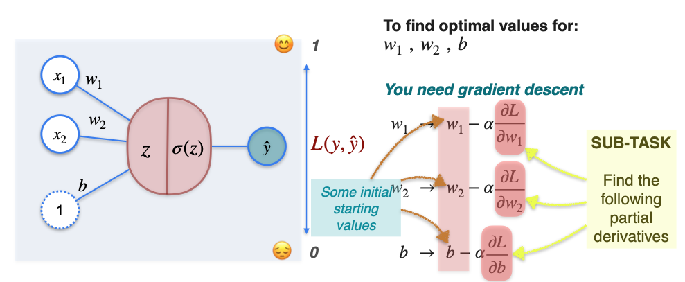

# Classification with a Perceptron: Gradient Descent

Now that we have all the components of a classification perceptron, we can learn how to train it. The process is very similar to how we trained our regression model: we will use **Gradient Descent** to find the best possible weights and bias.

Let's use our alien sentiment analysis problem as the example.

**The Goal:**
We want to find the perfect weights (`w₁`, `w₂`) and bias (`b`) that will make our perceptron's predictions (`ŷ`) match the true labels (`y`) as closely as possible. To do this, we must minimize an error, which we measure with a **loss function**.

### The Loss Function for Classification: Log-Loss

For regression, we used the Mean Squared Error loss function. For classification, while MSE *can* work, a much more effective and standard choice is the **Log-Loss** (also called Binary Cross-Entropy).

We've already developed the intuition for this function in the "Biased Coin Game" example. It's derived from the principles of probability and measures how "surprised" the model is by the correct answer.

The formula for the log-loss for a single data point is:

$$ L(y, \hat{y}) = -[y \cdot \ln(\hat{y}) + (1-y) \cdot \ln(1-\hat{y})] $$

Let's break down how it works:
* **If the true label `y` is 1:** The second part of the equation becomes zero. The loss is simply `-ln(ŷ)`. To make this loss small, the model needs to make `ŷ` (the predicted probability of being class 1) as close to 1 as possible.
* **If the true label `y` is 0:** The first part of the equation becomes zero. The loss is `-ln(1-ŷ)`. To make this loss small, the model needs to make `ŷ` as close to 0 as possible.

In short, the log-loss function heavily penalizes a model that is confidently wrong.

## Finding the Best Weights with Gradient Descent

Our main goal is to find the weights `w₁`, `w₂`, and bias `b` that minimize the total log-loss across our entire dataset. We will use Gradient Descent to do this.

The update rules are the same as before, but now we are taking the partial derivatives of our new log-loss function, `L`:

* $w_{1, new} = w_{1, old} - \alpha \cdot \frac{\partial L}{\partial w_1}$  

* $w_{2, new} = w_{2, old} - \alpha \cdot \frac{\partial L}{\partial w_2}$  

* $b_{new} = b_{old} - \alpha \cdot \frac{\partial L}{\partial b}$

The algorithm is as follows:
1.  Start with random values for `w₁`, `w₂`, and `b`.
2.  Calculate the partial derivatives of the log-loss with respect to each parameter.
3.  Update the parameters by taking a small step in the opposite direction of the gradient.
4.  Repeat for many iterations.

In the next lesson, we will dive into the calculus and use the chain rule to find these partial derivatives. You will see that the sigmoid and log-loss functions work together beautifully to produce a very simple and elegant result.

