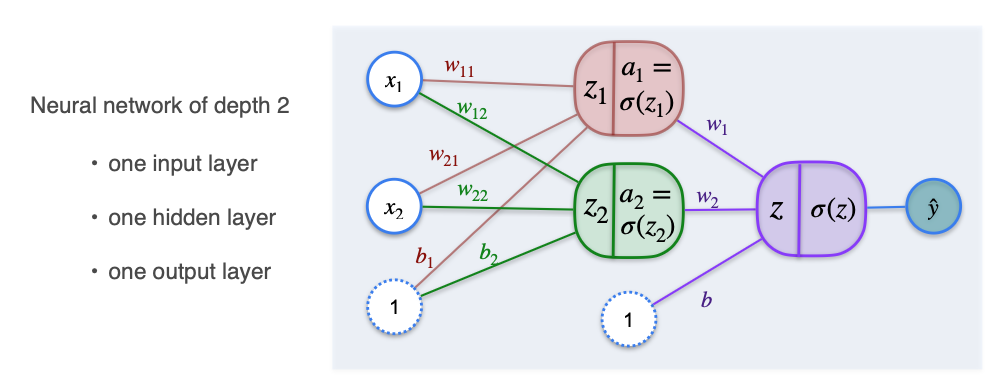
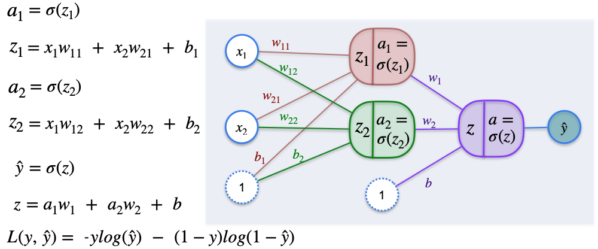

# Classification with a Neural Network: Introduction

Now that we know what a perceptron is, we are just one step from understanding a **neural network**. A neural network is simply a collection of perceptrons organized in layers, where the outputs of one layer become the inputs for the next.

### Why Do We Need More Than One Perceptron?

A single perceptron, as we've seen, can only create a single straight line as its decision boundary. This is great for "linearly separable" problems, but many real-world relationships are more complex.

To create more complex, non-linear decision boundaries, we need to combine multiple perceptrons. This is the core idea of a neural network.

## The Architecture of a Simple Neural Network

Let's build a simple network with two layers. It will have one "hidden layer" with two perceptrons, and an "output layer" with one perceptron that gives us the final prediction.

1.  **Input Layer:** Our features, $x_1$ and $x_2$.
2.  **Hidden Layer:** This layer contains two perceptrons (the red and green nodes). Each one takes the original inputs, applies its own unique set of weights and a bias, and calculates its own output ($a_1$ and $a_2$).
3.  **Output Layer:** This layer contains one final perceptron (the purple node). It takes the outputs of the hidden layer ($a_1$ and $a_2$) as its inputs, applies *its* own weights and bias, and produces the final prediction, `ŷ`.

By combining perceptrons in this way, the network can learn much more complex patterns than a single straight line.

## The Math of the Neural Network

Let's break down the calculations step-by-step.

### The Hidden Layer

* **Red Perceptron (Node 1):**
    * Summation: $z_1 = w_{11}x_1 + w_{21}x_2 + b_1$
    * Activation: $a_1 = \sigma(z_1)$  

* **Green Perceptron (Node 2):**
    * Summation: $z_2 = w_{12}x_1 + w_{22}x_2 + b_2$
    * Activation: $a_2 = \sigma(z_2)$

The values $a_1$ and $a_2$ are the outputs of the hidden layer.

### The Output Layer

* **Purple Perceptron (Output Node):**
    * This perceptron takes $a_1$ and $a_2$ as its inputs.
    * Summation: $z = w_1a_1 + w_2a_2 + b$
    * Final Activation (Prediction): $\hat{y} = \sigma(z)$

This final value, `ŷ`, is the network's prediction—a probability between 0 and 1.

## Training the Neural Network

To train this network, our goal is the same as before: we need to find the optimal values for **all** the weights and biases (`w₁₁`, `w₂₁`, `b₁`, `w₁₂`, `w₂₂`, `b₂`, `w₁`, `w₂`, `b`) that minimize our **log-loss function**.

We will do this using **Gradient Descent**. The process is conceptually the same, but now we must calculate the partial derivative of the loss with respect to *every single parameter* in the network. This requires repeated application of the **chain rule**, a process famously known as **backpropagation**, which we will explore in the next lesson.

