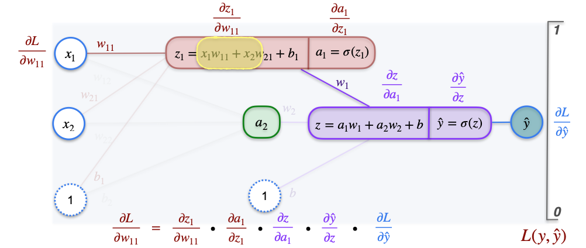

# Classification with a Neural Network: Minimizing Log-Loss

Now that we have our neural network architecture, our goal is to find the optimal values for all its weights and biases to minimize the log-loss function. We will do this using **Gradient Descent**.

The process requires us to calculate the partial derivative of the final loss `L` with respect to *every single parameter* in the network. This tells us how to adjust each weight and bias to reduce the overall error.

This is where the **chain rule** becomes incredibly powerful.

## The Chain of Dependencies

Let's trace how a single weight from the first layer, like `w₁₁`, affects the final loss `L`. It's a long chain:

$$ w_{11} \quad \longrightarrow \quad z_1 \quad \longrightarrow \quad a_1 \quad \longrightarrow \quad z \quad \longrightarrow \quad \hat{y} \quad \longrightarrow \quad L $$

To find the derivative $\frac{\partial L}{\partial w_{11}}$, we must multiply the derivatives of each link in this chain:

$$ \frac{\partial L}{\partial w_{11}} = \frac{\partial L}{\partial \hat{y}} \cdot \frac{\partial \hat{y}}{\partial z} \cdot \frac{\partial z}{\partial a_1} \cdot \frac{\partial a_1}{\partial z_1} \cdot \frac{\partial z_1}{\partial w_{11}} $$

This process of propagating the error backward through the network's layers is called **backpropagation**.

## Calculating the Component Derivatives

Let's break down the long chain into its simpler components.

**Reference Formulas:**
* **Loss:** $L(y, \hat{y}) = -[y \ln(\hat{y}) + (1-y) \ln(1-\hat{y})]$  

* **Final Activation:** $\hat{y} = \sigma(z)$  

* **Final Summation:** $z = w_1a_1 + w_2a_2 + b$  

* **Hidden Activation:** $a_1 = \sigma(z_1)$  

* **Hidden Summation:** $z_1 = w_{11}x_1 + w_{21}x_2 + b_1$

**The Derivatives:**

1.  **$\frac{\partial L}{\partial \hat{y}}$:** We already calculated this for the single perceptron. It is $\frac{\hat{y}-y}{\hat{y}(1-\hat{y})}$.  

2.  **$\frac{\partial \hat{y}}{\partial z}$:** The derivative of the sigmoid function is $\hat{y}(1-\hat{y})$.  

3.  **$\frac{\partial z}{\partial a_1}$:** From the final summation, this is simply the weight $w_1$.  

4.  **$\frac{\partial a_1}{\partial z_1}$:** This is another sigmoid derivative, so it's $a_1(1-a_1)$.  

5.  **$\frac{\partial z_1}{\partial w_{11}}$:** From the hidden summation, this is simply the input $x_1$.  

## Assembling the Gradient for the First Layer

Now, let's multiply these components together to find the derivative for a first-layer weight, $\frac{\partial L}{\partial w_{11}}$:

$$ \frac{\partial L}{\partial w_{11}} = \underbrace{\left(\frac{\hat{y}-y}{\hat{y}(1-\hat{y})}\right)} \cdot \underbrace{(\hat{y}(1-\hat{y}))} \cdot \underbrace{(w_1)} \cdot \underbrace{(a_1(1-a_1))} \cdot \underbrace{(x_1)} $$

The first two terms cancel out beautifully, leaving a much simpler expression:

$$ \frac{\partial L}{\partial w_{11}} = (\hat{y}-y) \cdot w_1 \cdot a_1(1-a_1) \cdot x_1 $$

Similarly, for the first-layer bias `b₁`, the only change is the last term:

$$ \frac{\partial L}{\partial b_1} = (\hat{y}-y) \cdot w_1 \cdot a_1(1-a_1) \cdot 1 $$

## Assembling the Gradient for the Second Layer

The chain for the second-layer weights (like `w₁`) is much shorter:

$$ w_1 \quad \longrightarrow \quad z \quad \longrightarrow \quad \hat{y} \quad \longrightarrow \quad L $$

$$ \frac{\partial L}{\partial w_1} = \frac{\partial L}{\partial \hat{y}} \cdot \frac{\partial \hat{y}}{\partial z} \cdot \frac{\partial z}{\partial w_1} $$

$$ = \underbrace{\left(\frac{\hat{y}-y}{\hat{y}(1-\hat{y})}\right)} \cdot \underbrace{(\hat{y}(1-\hat{y}))} \cdot \underbrace{(a_1)} = (\hat{y}-y)a_1 $$

## Summary of Final Gradient Descent Update Rules

After all the calculus and cancellations, we are left with surprisingly elegant update rules. The term `(ŷ - y)` is the final error of the network.

**For the Output Layer (Purple Node):**
* $w_1 \leftarrow w_1 - \alpha \cdot (\hat{y}-y)a_1$  

* $w_2 \leftarrow w_2 - \alpha \cdot (\hat{y}-y)a_2$  

* $b \leftarrow b - \alpha \cdot (\hat{y}-y)$

**For the Hidden Layer (Red Node):**
* $w_{11} \leftarrow w_{11} - \alpha \cdot (\hat{y}-y)w_1 a_1(1-a_1)x_1$  

* $w_{21} \leftarrow w_{21} - \alpha \cdot (\hat{y}-y)w_1 a_1(1-a_1)x_2$

* $b_1 \leftarrow b_1 - \alpha \cdot (\hat{y}-y)w_1 a_1(1-a_1)$

*(Similar rules apply for the Green Node's parameters)*

By iterating these update steps many times, we can train our neural network to find the optimal set of weights and biases that best fits our data.

---

**Next:** [Gradient Descent and Backpropagation](./10_gradient_descent_and_backpropagation.md)
