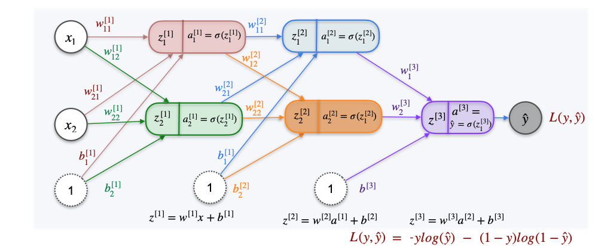

# Gradient Descent and Backpropagation

Now that we know how to calculate the derivatives for a single perceptron, we can extend this process to train a full, multi-layer neural network. The method is the same: we will use **Gradient Descent** to find the best weights and biases.

The only difference is that now we have many more parameters, so we need a systematic way to calculate the derivative of the loss function with respect to every single one of them.

## A Deeper Neural Network Architecture

Let's consider a neural network with three layers of transformations: an input layer, **two hidden layers**, and an output layer. To keep track of all the parameters, we will use a superscript to denote the layer number.

* **Layer 1 (First Hidden Layer):**
    * Weights: $W^{(1)}$, Biases: $b^{(1)}$
    * Activations: $a^{(1)} = \sigma(z^{(1)})$  

* **Layer 2 (Second Hidden Layer):**
    * Weights: $W^{(2)}$, Biases: $b^{(2)}$
    * Activations: $a^{(2)} = \sigma(z^{(2)})$  

* **Layer 3 (Output Layer):**
    * Weights: $W^{(3)}$, Bias: $b^{(3)}$
    * Final Prediction: $\hat{y} = a^{(3)} = \sigma(z^{(3)})$  

The goal is to adjust all the weights and biases in all three layers to minimize the **log-loss function**, $L(y, \hat{y})$.

## Backpropagation: The Chain Rule on a Grand Scale

To update each parameter using Gradient Descent, we need to find the partial derivative of the final loss `L` with respect to that parameter. This requires us to trace the path of influence from the parameter all the way to the final loss, applying the chain rule at each step.

This process of calculating the gradients by propagating the error signal backward through the network's layers is called **backpropagation**.

Let's trace the chain for a weight in the very first layer, like $w_{11}^{(1)}$. The chain of dependencies is now much longer:

$$ w_{11}^{(1)} \to z_1^{(1)} \to a_1^{(1)} \to z^{(2)} \to a^{(2)} \to z^{(3)} \to \hat{y} \to L $$

The chain rule for this is a very long product of derivatives:

$$ \frac{\partial L}{\partial w_{11}^{(1)}} = \frac{\partial L}{\partial \hat{y}} \cdot \frac{\partial \hat{y}}{\partial z^{(3)}} \cdot \frac{\partial z^{(3)}}{\partial a^{(2)}} \cdot \frac{\partial a^{(2)}}{\partial z^{(2)}} \cdot \frac{\partial z^{(2)}}{\partial a_1^{(1)}} \cdot \frac{\partial a_1^{(1)}}{\partial z_1^{(1)}} \cdot \frac{\partial z_1^{(1)}}{\partial w_{11}^{(1)}} $$

## The Efficiency of Backpropagation

While this looks incredibly complex, the good news is that we don't have to calculate everything from scratch for each parameter. Backpropagation is a very efficient algorithm because it **reuses calculations**.

The process works like this:
1.  **Forward Pass:** We feed an input through the network and calculate the output `ŷ` and the final loss `L`. We store all the intermediate values ($z^{(1)}, a^{(1)}, z^{(2)}, a^{(2)}, z^{(3)}$) along the way.  

2.  **Backward Pass:**
    * First, we calculate the derivatives at the very end of the chain ($\frac{\partial L}{\partial \hat{y}}$ and $\frac{\partial \hat{y}}{\partial z^{(3)}}$).
    * We use these to find the gradients for the parameters in the **last layer** (Layer 3).
    * Then, we take that result and continue "propagating" the error backward to calculate the gradients for the **second-to-last layer** (Layer 2), reusing the derivatives we've already computed.
    * Finally, we continue this process back to the **first layer**, again reusing all the previous calculations.

This step-by-step backward flow is much more efficient than calculating the entire long chain rule for every single weight individually.

The good news for a machine learning practitioner is that modern libraries like TensorFlow and Keras perform this entire backpropagation process for you automatically. However, understanding that it's just a clever and recursive application of the chain rule is fundamental to knowing how neural networks truly learn.

