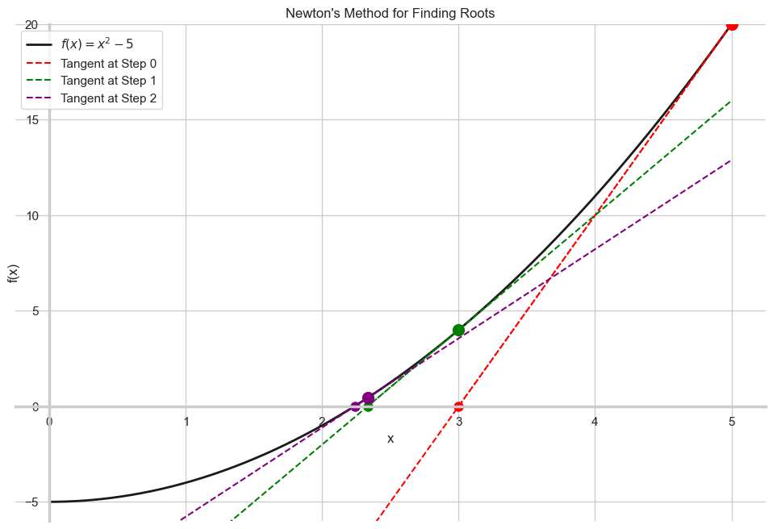

# Newton's Method: Introduction

In the previous lessons, we learned how to find the minimum of a function using Gradient Descent. **Newton's method** is another powerful, iterative algorithm. However, its primary purpose is different: it's designed to find the **roots (or zeros)** of a function—the points where the function crosses the x-axis, i.e., where `f(x) = 0`.

We can then cleverly adapt this root-finding algorithm for optimization.

## The Intuition: Riding the Tangent Line

Newton's method is an iterative process for approximating a function's root. The core idea is:

1.  **Start** at a random point `x₀` on the curve.
2.  **Draw the tangent line** to the curve at that point.
3.  **Find the root of the tangent line.** Follow the tangent line down until it crosses the x-axis. This crossing point is our new, better guess, `x₁`.
4.  **Repeat.** Draw a new tangent line at `x₁`, find where it crosses the x-axis to get `x₂`, and so on.

As you can see in the visualization, this process converges on the true root of the function incredibly quickly:

## Deriving the Formula

We can derive the update rule for Newton's method from the definition of the slope. The slope of the tangent line at a point `xₖ` is `f'(xₖ)`.

Using the rise-over-run formula for the tangent line:

$$ \text{Slope} = f'(x_k) = \frac{\text{Rise}}{\text{Run}} = \frac{f(x_k) - 0}{x_k - x_{k+1}} $$

Now, we just need to solve this equation for our next point, $x_{k+1}$:

$$ x_k - x_{k+1} = \frac{f(x_k)}{f'(x_k)} $$

$$ x_{k+1} = x_k - \frac{f(x_k)}{f'(x_k)} $$

This is the iterative update rule for Newton's method.

## Using Newton's Method for Optimization

How can we use a root-finding algorithm to find the **minimum** of a function?

We simply remember the rule from our previous lessons: **the minimum of a function `g(x)` occurs where its derivative `g'(x)` is zero.**

Therefore, to minimize `g(x)`, we can apply Newton's method to find the root of its derivative, `g'(x)`.

This leads to a slightly different update rule for optimization. Let's compare the two:

| Method | Goal | Update Rule |
| :--- | :--- | :--- |
| **Newton's Method (Root Finding)** | Find `x` such that `f(x) = 0` | $x_{k+1} = x_k - \frac{f(x_k)}{f'(x_k)}$ |
| **Newton's Method (Optimization)** | Find `x` such that `g'(x) = 0` | $x_{k+1} = x_k - \frac{g'(x_k)}{g''(x_k)}$ |

Notice that for optimization, we need to calculate both the first and the **second derivative** (`g''`) of our original function.

---

**Next:** [Newton's Method: An Example](./02_newtons_method--an_example.md)