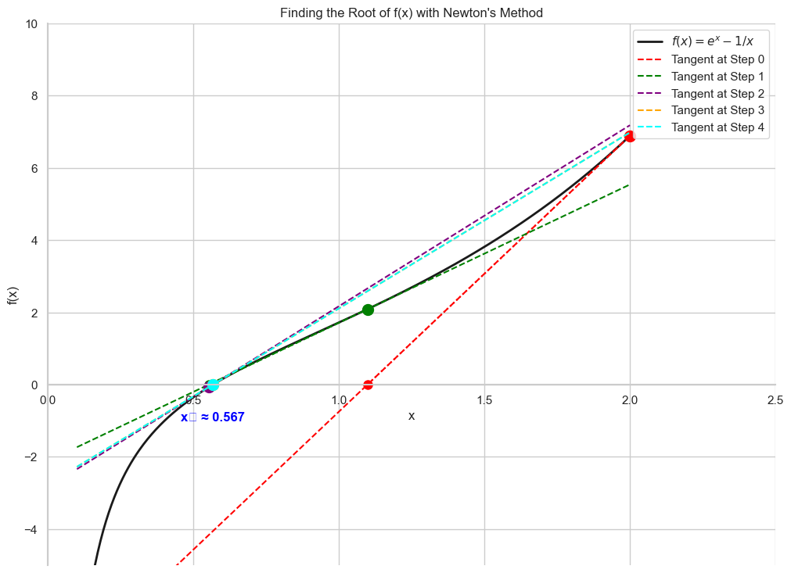

# Newton's Method: An Example

Now that we know the theory, let's put Newton's method into action. We will use it to solve the optimization problem from our Gradient Descent lesson, which was to find the minimum of the function:

$$ g(x) = e^x - \ln(x) $$

Recall that finding the minimum of a function `g(x)` is the same as finding the **root (or zero)** of its derivative, `g'(x)`.

So, our new goal is to use Newton's method to find the root of the function:

$$ f(x) = g'(x) = e^x - \frac{1}{x} $$

To do this, we need both this function `f(x)` and its derivative `f'(x)`, which is the second derivative of our original function, `g''(x)`.

* **Function (g'):** $f(x) = e^x - \frac{1}{x}$
* **Derivative of Function (g''):** $f'(x) = e^x + \frac{1}{x^2}$

We will now apply the Newton's method update rule to iteratively find the root of `f(x)`.

$$ x_{k+1} = x_k - \frac{f(x_k)}{f'(x_k)} $$

Let's perform the first few iterations by hand to see the process in detail.

* **Starting Point:** Let's choose $x_0 = 2.0$.
* **Update Rule:** $x_{new} = x_{old} - \frac{e^{x_{old}} - 1/x_{old}}{e^{x_{old}} + 1/x_{old}^2}$

### Iteration 1 (Finding x₁):
1.  **Calculate f(x₀):** $f(2.0) = e^2 - 1/2 \approx 7.389 - 0.5 = 6.889$
2.  **Calculate f'(x₀):** $f'(2.0) = e^2 + 1/2^2 \approx 7.389 + 0.25 = 7.639$
3.  **Update x:** $x_1 = 2.0 - \frac{6.889}{7.639} \approx 2.0 - 0.902 = 1.098$

### Iteration 2 (Finding x₂):
1.  **Calculate f(x₁):** $f(1.098) = e^{1.098} - 1/1.098 \approx 2.997 - 0.911 = 2.086$
2.  **Calculate f'(x₁):** $f'(1.098) = e^{1.098} + 1/(1.098)^2 \approx 2.997 + 0.830 = 3.827$
3.  **Update x:** $x_2 = 1.098 - \frac{2.086}{3.827} \approx 1.098 - 0.545 = 0.553$

In just two steps, we have already moved from `x=2.0` to `x=0.553`, which is very close to the true root. This demonstrates the rapid convergence of Newton's method.

## Analyzing the Convergence

As the plot shows, Newton's method converges to the solution with incredible speed.

* **x₀ = 2.0**
* **x₁ ≈ 0.97**
* **x₂ ≈ 0.63**
* **x₃ ≈ 0.570**
* **x₄ ≈ 0.567**

In only a few iterations, we have arrived at an excellent approximation of the true minimum (`x ≈ 0.567`), which is known as the Omega constant. This demonstrates the power and speed of Newton's method. Just like with Gradient Descent, we found the minimum without ever needing to solve the difficult equation $e^x - 1/x = 0$ analytically.