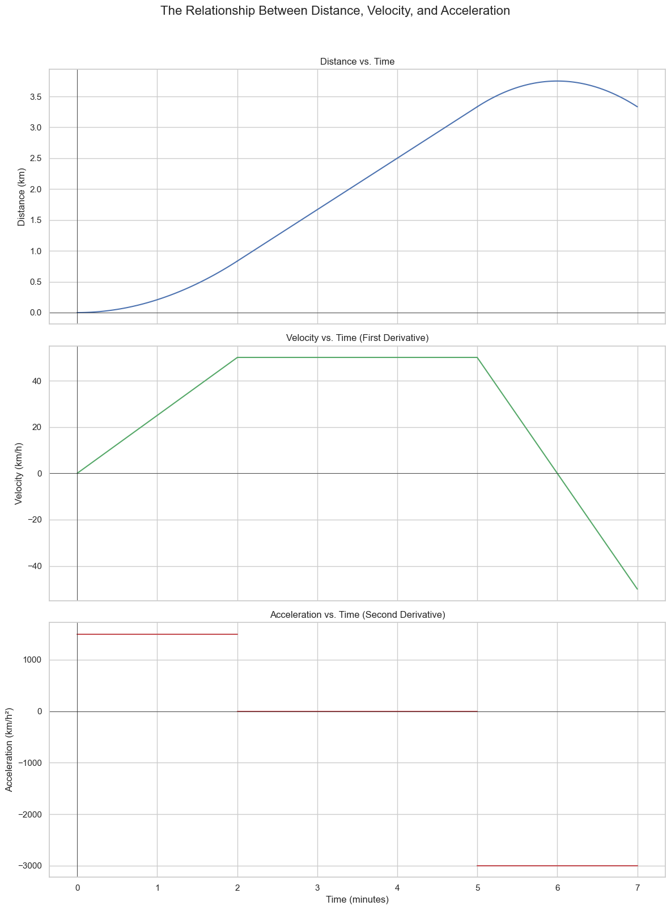

# The Second Derivative

In the previous lesson, we saw that Newton's method for optimization requires the derivative of a derivative. This has a formal name: the **second derivative**.

The second derivative gives us crucial information about a function's **curvature**—the way it bends. This is very useful in optimization for distinguishing between a maximum and a minimum.

### Notation
* **Leibniz's Notation:** $\frac{d^2f}{dx^2}$
* **Lagrange's Notation:** $f''(x)$ (read as "f double-prime of x")

## An Analogy: Distance, Velocity, and Acceleration

The best way to understand the second derivative is to return to our car analogy.
* If the function `x(t)` represents the **distance** traveled by a car...
* ...then its first derivative, `x'(t)` or `dx/dt`, is the **velocity**.
* ...and its second derivative, `x''(t)` or `d²x/dt²`, is the **acceleration**.

Acceleration is the *rate of change of velocity*.
* **Positive acceleration:** You are speeding up.
* **Negative acceleration:** You are slowing down (decelerating).
* **Zero acceleration:** You are moving at a constant velocity.

## The Second Derivative and Curvature (Concavity)

The second derivative gives us a measure of the **curvature** of a function, also known as its **concavity**.

* If $f''(x) > 0$, the function is **concave up** (like a happy face 😊). This means the slope (the first derivative) is increasing. In our car example, this corresponds to positive acceleration.
* If $f''(x) < 0$, the function is **concave down** (like a sad face 😞). This means the slope is decreasing. This corresponds to negative acceleration (deceleration).
* If $f''(x) = 0$, the function has no curvature at that point (it's a straight line).

## The Second Derivative Test for Optimization

This property is extremely useful for optimization. We already know that candidates for maxima and minima occur where the first derivative is zero ($f'(x) = 0$). The **second derivative test** helps us classify these points.

Let's say we have a point `c` where $f'(c) = 0$.
1.  **If $f''(c) > 0$ (concave up):** The point `c` is a **local minimum**.
2.  **If $f''(c) < 0$ (concave down):** The point `c` is a **local maximum**.
3.  **If $f''(c) = 0$:** The test is inconclusive.

This is a powerful tool because it allows us to distinguish between the peaks and valleys of a function by simply checking the sign of the second derivative at the points where the slope is flat.