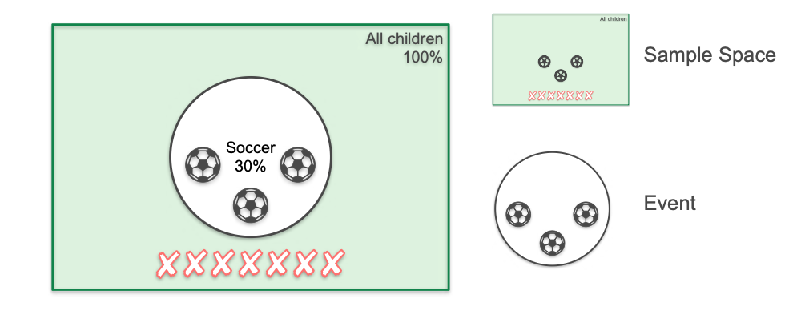

# What is Probability?

In this module, we will learn the fundamentals of probability, which is the mathematical framework for quantifying uncertainty.

Simply put, **probability** is a measure of how likely an event is to occur. It's a number between 0 and 1 (or 0% and 100%).
* A probability of **0** means the event is impossible.
* A probability of **1** means the event is certain.

## A Simple Problem: The School Soccer Team

Let's start with an intuitive problem to define the core concepts.

**Scenario:** A school has 10 children. 3 of these children play soccer, and 7 do not. If we pick one child at random, what is the probability that they play soccer?

To solve this, we use the basic formula for probability:

```math
P(\text{Event}) = \frac{\text{Number of Favorable Outcomes}}{\text{Total Number of Possible Outcomes}}
```  

* The **event** is the outcome we are interested in: "the child plays soccer." The number of favorable outcomes is **3**.
* The **sample space** is the set of all possible outcomes: "all the children in the school." The total number of outcomes is **10**.

Therefore, the probability is:
$$ P(\text{soccer}) = \frac{3}{10} = 0.3 \quad \text{or} \quad 30\% $$

We can visualize this relationship using a Venn diagram:



## The Coin Flip Experiment

In probability, an **experiment** is any process that produces an uncertain outcome.

### Experiment 1: Flipping One Coin
For a single flip of a fair coin, the sample space consists of two equally likely outcomes: {Heads, Tails}.
* **Event:** Landing on Heads.
* **Sample Space:** {Heads, Tails}
* **Probability:** $P(\text{Heads}) = \frac{1}{2} = 0.5$

### Experiment 2: Flipping Two Coins
If we flip two coins, we can map out all the possible outcomes:
* Coin 1 is Heads -> Coin 2 can be Heads or Tails  (HH, HT)
* Coin 1 is Tails  -> Coin 2 can be Heads or Tails  (TH, TT)

Our sample space has 4 total possible outcomes: **{HH, HT, TH, TT}**.

**Quiz:** What is the probability of both coins landing on heads?
* The number of favorable outcomes (HH) is **1**.
* The total number of outcomes is **4**.
* **Probability:** $P(\text{HH}) = \frac{1}{4} = 0.25$

### Experiment 3: Flipping Three Coins
If we flip three coins, the number of outcomes doubles again. The sample space is:
**{HHH, HHT, HTH, HTT, THH, THT, TTH, TTT}**

There are **8** total possible outcomes.

**Quiz:** What is the probability of all three coins landing on heads?
* The number of favorable outcomes (HHH) is **1**.
* The total number of outcomes is **8**.
* **Probability:** $P(\text{HHH}) = \frac{1}{8} = 0.125$

## The Dice Roll Experiment

Let's reinforce the concept of probability using the experiment of rolling a fair, six-sided die.

### Experiment 1: Rolling One Die

**Question:** What is the probability of rolling a 6?

* **Sample Space:** There are 6 equally likely outcomes: {1, 2, 3, 4, 5, 6}.
* **Event:** The outcome we are interested in is "rolling a 6." There is only **1** favorable outcome.
* **Probability:**
    $$ P(\text{rolling a 6}) = \frac{1}{6} $$

### Experiment 2: Rolling Two Dice

**Question:** What is the probability of rolling two 6s?

To find the answer, we need to determine the size of our sample space. For each of the 6 possible outcomes of the first die, there are 6 possible outcomes for the second die. Therefore, the total number of possible outcomes is $6 \times 6 = 36$.

The sample space is {(1,1), (1,2), ..., (6,5), (6,6)}.

* **Sample Space:** 36 total outcomes.
* **Event:** The outcome we want is "(6, 6)". There is only **1** favorable outcome.
* **Probability:**
    $$ P(\text{rolling two 6s}) = \frac{1}{36} $$