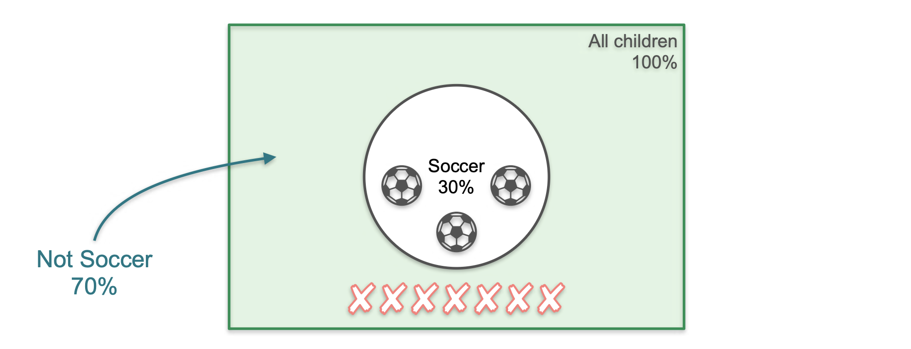

# The Complement of an Event

In the last lesson, we learned how to calculate the probability of an event occurring. Now, we'll talk about the **complement**, which is the probability that the event **does not** occur.

If an event has a 75% chance of happening, its complement—the chance of it *not* happening—is 25%.

Let's return to our school with 10 kids, where 3 play soccer and 7 do not.

**Question:** What is the probability that a child picked at random **does not** play soccer?

Using our standard formula:
* **Event:** "The child does not play soccer." The number of favorable outcomes is **7**.
* **Sample Space:** 10 total children.
* **Probability:**
```math
P(\text{not soccer}) = \frac{7}{10} = 0.7
```
<br>

Notice that this is related to the probability of the original event:
* $P(\text{soccer}) = 0.3$
* $P(\text{not soccer}) = 0.7$
* $0.3 + 0.7 = 1$

This is always true, and it leads us to the **Complement Rule**.

## The Complement Rule

The probability of an event `A` not occurring is equal to 1 minus the probability of `A` occurring.

#### > Formula:
```math
P(A') = 1 - P(A)
```
*Where `A'` (A-prime) represents the complement of event `A`.*

In the Venn diagram, if the event `P(soccer)` is the area inside the circle (30%), then its complement `P(not soccer)` is the entire area *outside* the circle (70%). Together, they make up the entire sample space (100%).



---

## Applying the Complement Rule

### Example 1: Three Coin Flips
**Question:** What's the probability of **not** obtaining three heads (HHH)?

Instead of counting all 7 other possibilities, we can use the complement rule.
* The probability of getting three heads is $P(\text{HHH}) = \frac{1}{8}$.
* The probability of *not* getting three heads is:
    $$ P(\text{not HHH}) = 1 - P(\text{HHH}) = 1 - \frac{1}{8} = \frac{7}{8} $$

### Example 2: Rolling a Die
**Question:** What's the probability of rolling anything **other than** a 6?

* The probability of rolling a 6 is $P(6) = \frac{1}{6}$.
* The probability of *not* rolling a 6 is:
    $$ P(\text{not 6}) = 1 - P(6) = 1 - \frac{1}{6} = \frac{5}{6} $$

The complement rule is a very powerful tool that often simplifies probability problems by allowing us to calculate the probability of the event we *don't* want and subtracting it from 1.