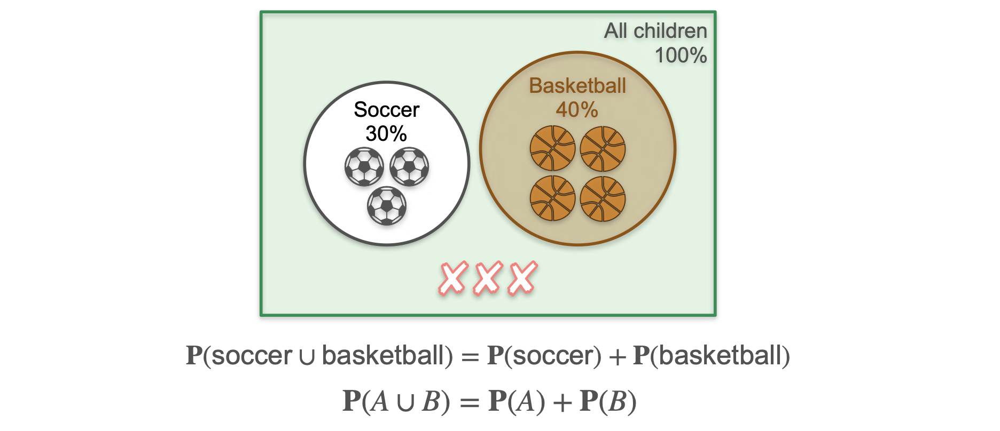
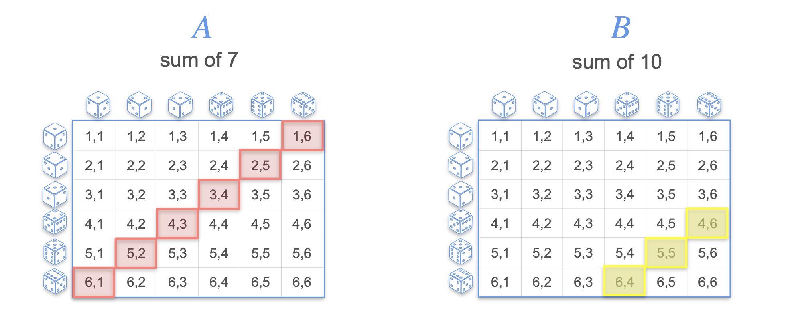
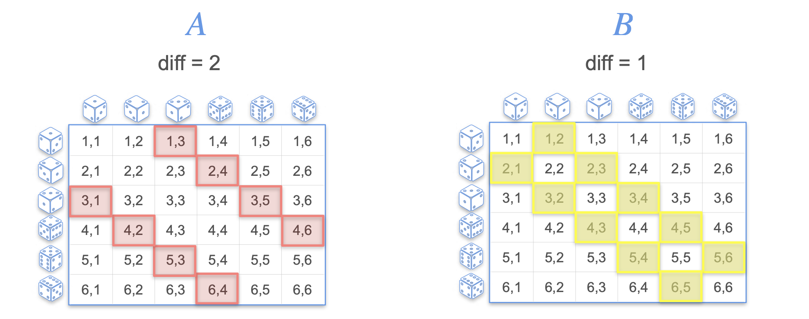

# The Sum of Probabilities (for Disjoint Events)

In this lesson, we will learn how to calculate the probability of one event *or* another event occurring. The rule is simple: if the events are **disjoint**, we can just add their probabilities.

**What are disjoint (or mutually exclusive) events?**
Two events are disjoint if they **cannot happen at the same time**. There is no overlap between them.

Let's use an example.

**Scenario:** In a school, kids can only play one sport: either soccer or basketball.
* The probability that a randomly picked kid plays soccer is `P(Soccer) = 0.3`.
* The probability that a randomly picked kid plays basketball is `P(Basketball) = 0.4`.

**Question:** What is the probability that a kid plays soccer OR basketball?

Since a kid cannot play both sports, these events are disjoint. We can find the total number of kids who play a sport and divide by the total. If there are 10 kids, 3 play soccer and 4 play basketball. The total number of kids who play a sport is $3 + 4 = 7$.

The probability is:
```math
P(\text{Soccer or Basketball}) = \frac{7}{10} = 0.7
```
<br>

Notice that this is simply the sum of the individual probabilities: $0.3 + 0.4 = 0.7$.

## The Addition Rule for Disjoint Events

This leads us to our main rule. If `A` and `B` are disjoint events, the probability of `A` or `B` happening is the sum of their probabilities.

> ```math 
> P(A \cup B) = P(A) + P(B)
> ```

In a Venn diagram, disjoint events are represented by two separate, non-overlapping circles. The probability of their union is the sum of the areas of the two circles.



## Applying the Rule to Dice Rolls

### Example 1: Rolling One Die
**Question:** What is the probability of rolling an even number or a 5?

* **Event A:** Rolling an even number {2, 4, 6}. The probability is $P(A) = \frac{3}{6}$
* **Event B:** Rolling a 5 {5}. The probability is $P(B) = \frac{1}{6}$

These events are disjoint because a number cannot be both even and five. Therefore:
```math
P(A \cup B) = P(A) + P(B) = \frac{3}{6} + \frac{1}{6} = \frac{4}{6} = \frac{2}{3}
```
<br>

### Example 2: Rolling Two Dice
Let's visualize the sample space of 36 possible outcomes for rolling two dice.

**Question 1:** What is the probability of the sum being 7 or 10?
* **Event A (Sum = 7):** There are 6 favorable outcomes. $P(A) = \frac{6}{36}$
* **Event B (Sum = 10):** There are 3 favorable outcomes. $P(B) = \frac{3}{36}$
* These are disjoint events.
* $P(A \cup B) = \frac{6}{36} + \frac{3}{36} = \frac{9}{36} = \frac{1}{4}$



**Question 2:** What is the probability of the absolute difference being 2 or 1?
* **Event A (Difference = 2):** There are 8 favorable outcomes. $P(A) = \frac{8}{36}$
* **Event B (Difference = 1):** There are 10 favorable outcomes. $P(B) = \frac{10}{36}$
* These are disjoint events.
* $P(A \cup B) = \frac{8}{36} + \frac{10}{36} = \frac{18}{36} = \frac{1}{2}$



---

**Next:** [The Sum of Probabilities (for Joint Events)](./04_sum_of_probabilities--joint_events.md)