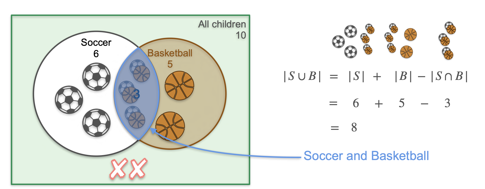
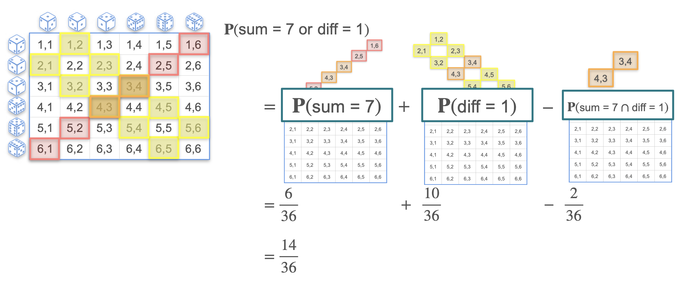

# The Sum of Probabilities (for Joint Events)

In the last lesson, we learned how to add the probabilities of **disjoint** (mutually exclusive) events. But what happens when the events are **not** disjoint, meaning they can happen at the same time?

If we simply add their probabilities, we run into a problem. For example, if `P(Rain) = 0.8` and `P(Windy) = 0.7`, adding them gives `1.5` or 150%, which is impossible. The issue is that we have failed to account for the possibility of it being **rainy and windy simultaneously**.

## The Problem of Over-Counting

Let's revisit our school example, but this time, kids are allowed to play more than one sport.

**Scenario:** In a school of 10 kids:
* 6 kids play soccer (`P(Soccer) = 0.6`).
* 5 kids play basketball (`P(Basketball) = 0.5`).
* 3 kids play **both** soccer and basketball (`P(Soccer and Basketball) = 0.3`).

**Question:** What is the probability that a kid plays soccer OR basketball?

If we simply add the number of soccer players (6) and basketball players (5), we get 11, which is more than the number of kids in the school. This is because we have **counted the 3 kids who play both sports twice**.

To get the correct count of kids who play at least one sport, we must add the two groups and then subtract the overlap that we double-counted:
`Total Athletes = (Soccer Players) + (Basketball Players) - (Players of Both)`
`Total Athletes = 6 + 5 - 3 = 8`

The probability is therefore $\frac{8}{10} = 0.8$



## The General Addition Rule (Inclusion-Exclusion Principle)

This logic gives us the general addition rule for any two events, `A` and `B`.

> $$ P(A \cup B) = P(A) + P(B) - P(A \cap B) $$


This is also known as the **Inclusion-Exclusion Principle**. We *include* the probabilities of both events and then *exclude* the intersection that we counted twice.

*Note: This rule also works for disjoint events. Since their intersection is impossible, `P(A ∩ B) = 0`, and the formula simplifies back to `P(A ∪ B) = P(A) + P(B)`.*

## Applying the Rule to Dice Rolls

Let's visualize a more complex example with two dice.

**Question:** What is the probability of the sum being 7 **or** the absolute difference being 1?

These events are **not disjoint**. As the heatmap shows, the outcomes `(3, 4)` and `(4, 3)` satisfy both conditions. This is the **intersection**.

* **Event A (Sum = 7):** There are 6 favorable outcomes. $P(A) = \frac{6}{36}$
* **Event B (Difference = 1):** There are 10 favorable outcomes. $P(B) = \frac{10}{36}$
* **Intersection (A ∩ B):** There are 2 favorable outcomes. $P(A \cap B) = \frac{2}{36}$

Now, we apply the general addition rule:
```math
P(A \cup B) = P(A) + P(B) - P(A \cap B)
```
<br> 

```math
P(A \cup B) = \frac{6}{36} + \frac{10}{36} - \frac{2}{36} = \frac{14}{36} = \frac{7}{18}
```
<br> 




---

**Next:** [Independence](./05_independence.md)