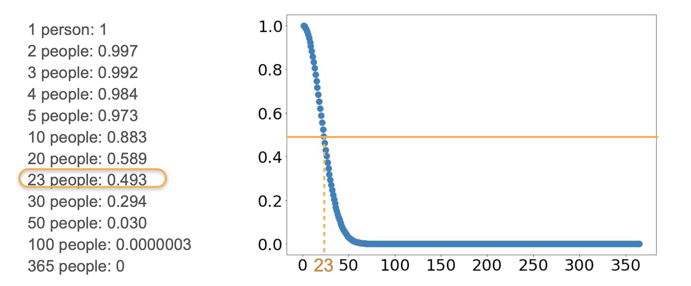

# Birthday Problem

In this lesson, we're going to talk about one of the most fascinating problems in probability: the **Birthday Problem**.

The question is: In a room with 30 people, which is more likely?
1. At least two people have the same birthday.
2. No two people have the same birthday.

Believe it or not, the answer is that it's **more likely that two people have the same birthday**. In fact, the probability is around 70%!

Let's see why.

## The Strategy: Using the Complement

Calculating the probability of "at least two people" sharing a birthday directly is very complicated. You would have to consider the case of exactly one pair, exactly two pairs, three people sharing a birthday, etc.

It's much, much easier to calculate the probability of the **complement event**: the probability that **no two people share the same birthday**.

Once we have that, we can use the complement rule:
```math
P(\text{at least one match}) = 1 - P(\text{no matches})
```
<br>

## Calculating the Probability of No Matches

Let's build this up person by person, assuming a year has 365 days.

* **Person 1:** Can have a birthday on any of the 365 days. The probability of having a unique birthday is $\frac{365}{365} = 1$
* **Person 2:** For this person to have a different birthday from Person 1, they must be born on one of the remaining 364 days. The probability of this is $\frac{364}{365}$
* **Person 3:** Must have a birthday on one of the remaining 363 days. The probability is $\frac{363}{365}$
* **Person 4:** Must have a birthday on one of the remaining 362 days. The probability is $\frac{362}{365}$

Since these are independent events, the probability that *all* of them have different birthdays is the **product** of these individual probabilities.

For a group of *n* people, the probability of no matching birthdays is:
```math
P(\text{no matches}) = \frac{365}{365} \times \frac{364}{365} \times \frac{363}{365} \times \dots \times \frac{365 - n + 1}{365}
```
<br>

Let's visualize how quickly this probability drops as the number of people increases.



## Analyzing the Results

As the plot clearly shows, the probability of everyone having a unique birthday drops surprisingly fast.

* For **n=23** people, the probability of no match drops just below 50% (to about 49.3%). This means it's already more likely that at least two people *do* share a birthday.
* For **n=30** people, the probability of no match is only about 29.4%. The probability of a match is therefore $1 - 0.294 = 70.6\%$.
* For **n=50** people, the probability of no match is a tiny 3%.

This non-intuitive result happens because we are not comparing one person's birthday to another's; we are checking every possible **pair** of people in the group, and the number of pairs grows much faster than the number of people.