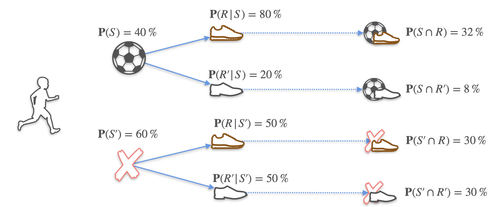

# Conditional Probability

In this lesson, we will explore the concept of **conditional probability**. This is all about calculating the probability of an event happening, **given that another event has already occurred**.

New information can change the probability of an outcome. For example, the probability of it being humid today is some number. However, if we are *given* the information that it rained yesterday, the probability of it being humid today might change.

Recall our experiment of flipping two fair coins. The sample space has four equally likely outcomes: **{HH, HT, TH, TT}**.

The probability of getting two heads is:
```math
P(\text{HH}) = \frac{1}{4}
```
<br>

Now, let's introduce a condition:

**New Question:** What is the probability that both coins land on heads, **given that we know the first coin landed on heads?**

This new piece of information—"the first coin landed on heads"—**reduces our sample space**. We are no longer considering all four possibilities. The outcomes where the first coin was tails (TH, TT) are now impossible.

Our new, smaller sample space is just **{HH, HT}**.

Within this new sample space of 2 outcomes, there is only 1 favorable outcome (HH). Therefore, the new probability is:
```math
P(\text{HH} \text{ | First is H}) = \frac{1}{2}
```
<br>

The vertical bar `|` is read as "given that." This is the standard notation for conditional probability.

### Visualizing with a Table

We can see this clearly in a table of outcomes:

| | Second: H | Second: T |
| :--- | :---: | :---: |
| **First: H** | HH | HT |
| **First: T** | TH | TT |

When we are given the condition "the first coin landed in heads," we are restricting ourselves to only the **first row**. Our world shrinks from 4 possibilities to 2.

**Another Question:** What is the probability of landing two heads, given that the first coin landed on tails?
```math
P(\text{HH} \text{ | First is T}) = ?
```
<br>

Now, we are restricted to the **second row**. In this new sample space of {TH, TT}, there are **zero** outcomes where both are heads.
```math
P(\text{HH} \text{ | First is T}) = \frac{0}{2} = 0
```
<br>

This makes sense. If the first coin was tails, it's impossible for both to be heads.

## The General Product Rule

Recall the product rule for *independent* events: $P(A \cap B) = P(A) \cdot P(B)$. This only works when the events don't affect each other. What if they are not independent?

Let's use a dice example.  

**Question:** What is the probability that if I roll two dice, the first die is a 6 **AND** the sum is 10?

There are 36 total outcomes. The only outcome that satisfies both conditions is **(6, 4)**. So, the probability is $\frac{1}{36}$

Let's try to build this with a rule.
* The probability that the first die is a 6 is $P(\text{First=6}) = \frac{6}{36} = \frac{1}{6}$
* Now, *given that* the first die is a 6, what is the probability that the sum is 10? Our sample space is now just the 6 outcomes where the first die is a 6: {(6,1), (6,2), (6,3), (6,4), (6,5), (6,6)}. Within this space, only one outcome, (6,4), gives a sum of 10. So, $P(\text{Sum=10} \text{ | First=6}) = \frac{1}{6}$

Notice that if we multiply these, we get the right answer:
```math
P(\text{First=6}) \cdot P(\text{Sum=10} \text{ | First=6}) = \frac{1}{6} \cdot \frac{1}{6} = \frac{1}{36}
```
<br>

This gives us the **General Product Rule**, which works for any events, independent or not:

> $$ P(A \cap B) = P(A) \cdot P(B|A) $$
<br>

*(Note: If A and B are independent, then `P(B|A)` is just `P(B)`, and this formula simplifies back to our original product rule.)*

## Applying the General Product Rule

Let's use a new, more detailed example to see how we can use the General Product Rule to calculate probabilities for dependent events.

**Scenario:** In a school of 100 kids, 40% play soccer.
* `P(Soccer) = 0.4`
* `P(Not Soccer) = 0.6`

We also have some additional information:
* Among the kids who **play soccer**, 80% wear running shoes. This is a conditional probability: `P(Running Shoes | Soccer) = 0.8`.
* Among the kids who **do not play soccer**, 50% wear running shoes. This is `P(Running Shoes | Not Soccer) = 0.5`.

**Question:** What is the probability that a randomly selected kid plays soccer AND wears running shoes?

We use the General Product Rule: $ P(A \cap B) = P(A) \cdot P(B|A) $.
```math
P(\text{Soccer} \cap \text{Running Shoes}) = P(\text{Soccer}) \cdot P(\text{Running Shoes | Soccer})
```
```math
= 0.4 \times 0.8 = 0.32
```
<br>

So, there is a 32% chance that a random kid plays soccer and wears running shoes.

### Visualizing with a Probability Tree

A probability tree is a fantastic way to visualize these conditional events and their outcomes.



The probability tree shows us the four possible, mutually exclusive outcomes for any given student:
1.  **Plays Soccer AND Wears Running Shoes:**
    * $P(S \cap R) = 0.4 \times 0.8 = 0.32$ (32%)
2.  **Plays Soccer AND Does NOT Wear Running Shoes:**
    * $P(S \cap R') = 0.4 \times 0.2 = 0.08$ (8%)
3.  **Does NOT Play Soccer AND Wears Running Shoes:**
    * $P(S' \cap R) = 0.6 \times 0.5 = 0.30$ (30%)
4.  **Does NOT Play Soccer AND Does NOT Wear Running Shoes:**
    * $P(S' \cap R') = 0.6 \times 0.5 = 0.30$ (30%)

Notice that the sum of the probabilities of all possible outcomes is $0.32 + 0.08 + 0.30 + 0.30 = 1.0$.
