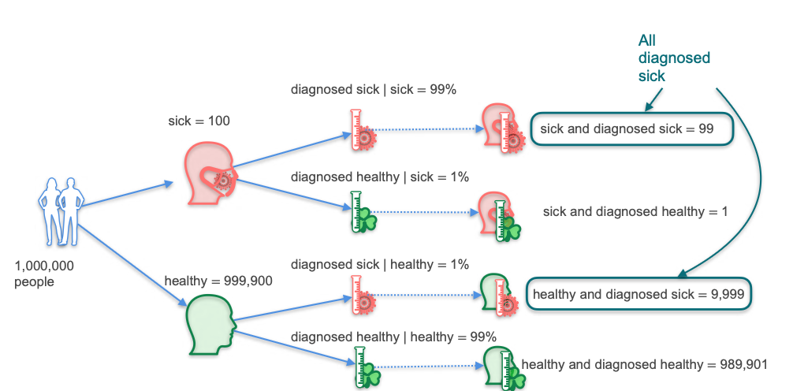

# Conditional Probability - Bayes' Theorem Intuition

In this lesson, we will explore one of the most important theorems in all of probability: **Bayes' Theorem**.

Bayes' theorem is the mathematical rule for updating our belief about a hypothesis given new evidence. It allows us to calculate a conditional probability, like `P(Hypothesis | Evidence)`, by using the inverse conditional probability, `P(Evidence | Hypothesis)`.

It is used everywhere in machine learning, in applications like spam filtering, medical diagnosis, and speech recognition.

## The Rare Disease Problem

To build our intuition, let's work through a classic example.

**Scenario:**
Imagine a rare disease that affects 1 in every 10,000 people. There is a diagnostic test for this disease that is 99% effective. You take the test, and the doctor calls to tell you that you **tested positive**.

**The Question:**
What is the probability that you actually have the disease, given that you tested positive?

Let's put some concrete numbers to this:
* **Population:** 1,000,000 people
* **Disease Prevalence:** 1 in 10,000 people are sick.
* **Test Effectiveness (99%):**
    * If a person **is sick**, the test will be positive 99% of the time (True Positive).
    * If a person **is healthy**, the test will be negative 99% of the time (True Negative). This also means it will incorrectly be positive 1% of the time (False Positive).

Before panicking, let's use probability to find the answer.

## Breaking Down the Population

Let's divide our 1,000,000 people into groups based on their health and their test results.

**1. Sick vs. Healthy Population:**
* **Sick People:** $1,000,000 \times \frac{1}{10,000} = 100$ people
* **Healthy People:** $1,000,000 - 100 = 999,900$ people

**2. Test Results for the Sick Population (100 people):**
* **Diagnosed Sick (True Positives):** $100 \times 0.99 = 99$ people
* **Diagnosed Healthy (False Negatives):** $100 \times 0.01 = 1$ person

**3. Test Results for the Healthy Population (999,900 people):**
* **Diagnosed Sick (False Positives):** $999,900 \times 0.01 = 9,999$ people
* **Diagnosed Healthy (True Negatives):** $999,900 \times 0.99 = 989,901$ people

## Calculating the Conditional Probability

Our new information is that we **tested positive**. This means we belong to the group of people who were diagnosed as sick. This is our new, smaller sample space.

**Total People Diagnosed Sick = (True Positives) + (False Positives)**
```math
\text{Total Diagnosed Sick} = 99 + 9,999 = 10,098 \text{ people}
```
<br>

Within this new sample space of 10,098 people, we want to find the probability that we are one of the ones who are *actually* sick.

```math
P(\text{Actually Sick} | \text{Diagnosed Sick}) = \frac{\text{Number Actually Sick and Diagnosed Sick}}{\text{Total Number Diagnosed Sick}}
```
```math
= \frac{99}{10,098} \approx 0.0098
```
<br>

The probability that you are actually sick is approximately **0.98%**, or less than 1%!

**Why is it so low?**
This counter-intuitive result happens because the disease is very rare. The number of healthy people is so large that even a small 1% error rate (the false positives) creates a group of people (`9,999`) that is much larger than the entire group of truly sick people (`100`).

## Visualizing with a Probability Tree

We can also visualize this process with a probability tree:

