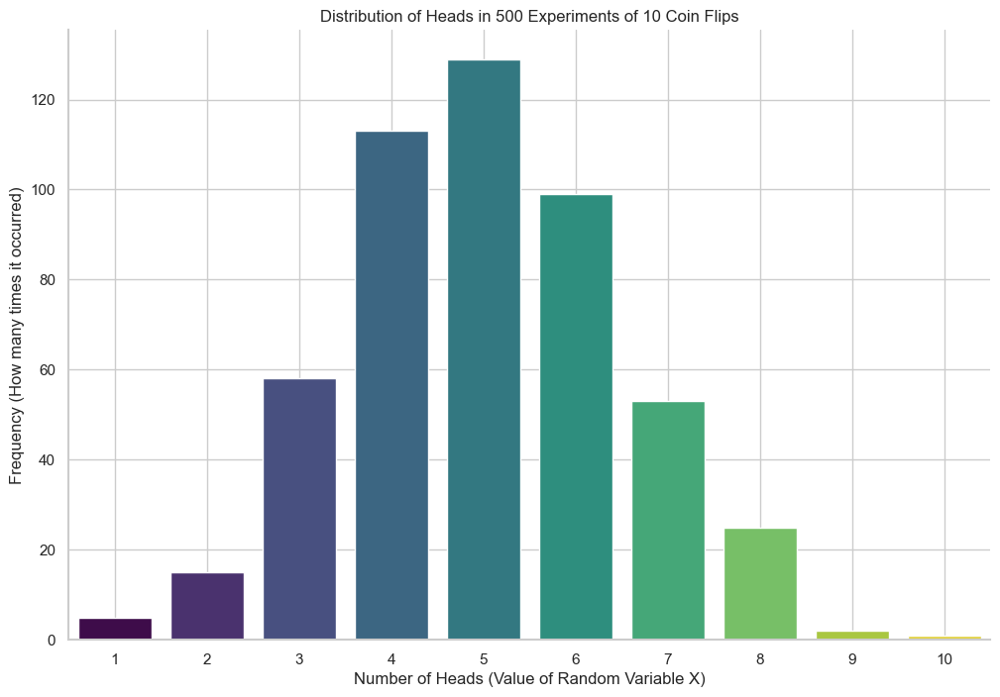

# Random Variables

In this lesson, we will explore one of the most important concepts in probability: the **random variable**.

Unlike an algebraic variable which holds a fixed value (e.g., `x = 3`), a random variable can take on many different values, each with an associated probability. It represents the numerical outcome of a random phenomenon.

Let's use a simple coin flip to understand this.
* **The Experiment:** We flip a fair coin once.
* **The Outcomes:** {Heads, Tails}, each with a probability of 0.5.

Now, let's define a random variable `X` to represent the "Number of Heads" in this experiment.
* If the outcome is **Heads**, then `X = 1`. The probability of this is `P(X=1) = 0.5`.
* If the outcome is **Tails**, then `X = 0`. The probability of this is `P(X=0) = 0.5`.

`X` is a random variable because its value is uncertain until the experiment is performed.

## A More Complex Example: 10 Coin Flips

Let's define a new random variable, `X`, as the total number of heads we obtain in 10 coin tosses.

The possible values for `X` are any integer from 0 (all tails) to 10 (all heads). Calculating the exact probability for each of these outcomes can be complex. For example, to find `P(X=9)`, we would need to count all the different sequences that result in exactly 9 heads.

To get an intuition for the probabilities, we can run a simulation. Let's simulate this experiment 500 times and plot the results in a histogram.

As the histogram shows, the most likely outcomes are centered around `X=5`, while extreme outcomes like `X=0` or `X=10` are very rare. This visual representation of the probabilities of all possible outcomes is called a **probability distribution**, which we will study in more detail soon.

## Types of Random Variables

Random variables are generally classified into two main types.

### 1. Discrete Random Variables
These variables can only take on a **countable** number of distinct values. The values can often be counted with integers.

* **Examples:**
    * The number of heads in 10 coin flips (can be 0, 1, ..., 10).
    * The number you get when you roll a die (can be 1, 2, 3, 4, 5, 6).
    * The number of defective products in a shipment.
    * The number of coin flips it takes *until* you get your first heads (can be 1, 2, 3, ..., which is infinite but still countable).

### 2. Continuous Random Variables
These variables can take on an **uncountable** number of values within a given range or interval.

* **Examples:**
    * The exact height of a person.
    * The amount of time you wait for a bus.
    * The exact temperature of a room.
    * The number of millimeters of rain in a month.

The key difference is that a discrete variable's possible values can be put in a list, whereas a continuous variable's possible values form a solid interval on the number line.

## Deterministic vs. Random Variables

It's important to distinguish the random variables we study in probability from the deterministic variables used in algebra and calculus.

* **Deterministic Variable:** Has a fixed, known value (e.g., `x = 2`).
* **Random Variable:** Has an uncertain value described by a probability distribution.

---

**Next:** [Probability Distributions (Discrete)](./02_discrete_probability_distributions.md)