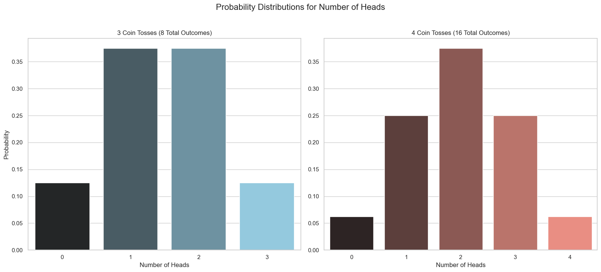

# Probability Distributions (Discrete)

In the previous lessons, we learned how to calculate the probability of a single event. A **probability distribution**, however, gives us the bigger picture. It's a function or a graph that describes the probability of **all possible outcomes** of a random variable.

Let's explore this with our coin flip experiment.

### The 3-Coin Toss Experiment
Let our random variable `X` be the **number of heads** when we toss three fair coins. The sample space has 8 total outcomes. Let's group them by the value of `X`:

* **X = 0 (No Heads):**
    * {TTT} - 1 outcome
    * **P(X=0) = 1/8**
* **X = 1 (One Head):**
    * {HTT, THT, TTH} - 3 outcomes
    * **P(X=1) = 3/8**
* **X = 2 (Two Heads):**
    * {HHT, HTH, THH} - 3 outcomes
    * **P(X=2) = 3/8**
* **X = 3 (Three Heads):**
    * {HHH} - 1 outcome
    * **P(X=3) = 1/8**

This table of probabilities is the probability distribution for our random variable `X`. It's much more likely to get 1 or 2 heads than 0 or 3, because there are more ways for those outcomes to happen. We can visualize this distribution with a histogram:



## The Probability Mass Function (PMF)

The function that gives us the probability for each possible value of a **discrete random variable** is called the **Probability Mass Function (PMF)**, often written as `p(x)`.

```math
p(x) = P(X = x)
```
<br>

It tells us how the total probability of 1 is "distributed" among the possible outcomes.

A function is a valid PMF if it satisfies two conditions:
1.  The probability for every possible outcome must be non-negative: $p(x) \ge 0$.
2.  The sum of the probabilities over all possible outcomes must be equal to 1.

## The Binomial Distribution

Notice that the shape of the probability distributions for 3, 4, and 5 coin tosses are all very similar—they are symmetric and bell-shaped. These random variables all belong to the same family of distributions, called the **Binomial Distribution**.

We will learn more about the Binomial distribution and other common probability distributions in the next lesson.