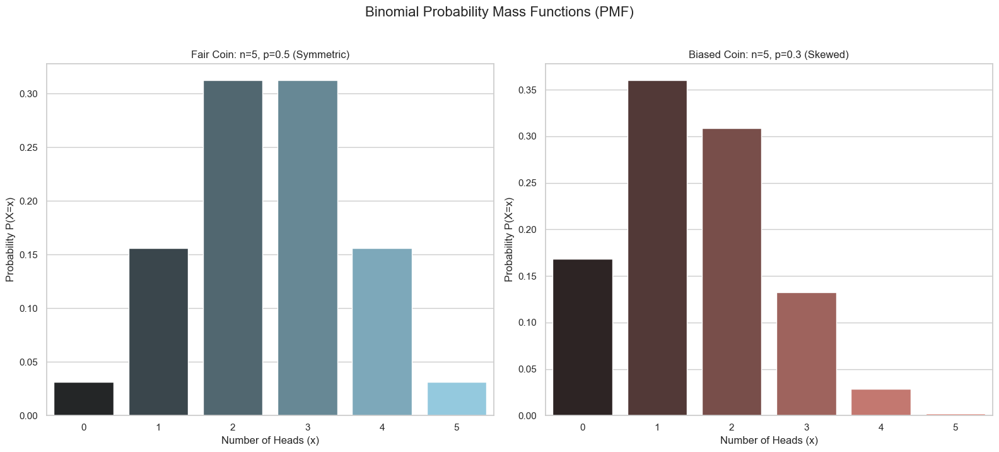

# Probability Distributions - The Binomial Distribution

Let's start with one of the simplest and most common discrete distributions: the **Binomial Distribution**.

The binomial distribution models the number of "successes" in a fixed number of independent trials. A classic example is counting the number of heads in multiple coin tosses.

If we toss a coin 10 times, the number of heads we can obtain is a random variable that can take any integer value from 0 to 10. The binomial distribution tells us the exact probability for each of these outcomes.

## Calculating Binomial Probabilities

Let's ask a specific question: What is the probability of obtaining exactly **2 heads** when you flip **5 fair coins**?

The process has two parts:
1.  **Calculate the probability of one specific sequence:**. 

* One possible sequence is `HHTTT`. Since each flip is an independent event with P(H)=0.5 and P(T)=0.5, the probability of this specific sequence is:

```math
(0.5) \times (0.5) \times (0.5) \times (0.5) \times (0.5) = (0.5)^5 = \frac{1}{32}
```
<br>

2.  **Count the number of possible sequences:**. 

`HHTTT` is not the only way to get 2 heads. `HTHTT` and `TTHHH` are other possibilities. We need to count how many unique ways we can arrange 2 heads and 3 tails.

This is a combination problem. The number of ways to choose *k* successes from *n* trials is given by the **binomial coefficient**:
```math
\binom{n}{k} = \frac{n!}{k!(n-k)!}
```
<br>

For our problem, this is "5 choose 2":
```math
\binom{5}{2} = \frac{5!}{2!(5-2)!} = \frac{120}{2 \cdot 6} = 10
```
<br>

There are **10** different ways to get exactly 2 heads in 5 flips.

Since each of these 10 sequences has a probability of 1/32, the total probability is:
```math
P(X=2) = 10 \times \frac{1}{32} = \frac{10}{32}
```
<br>

## The Binomial Probability Mass Function (PMF)

We can generalize this into a single formula, the PMF for the binomial distribution. This formula gives the probability of getting exactly `x` successes in `n` trials, where the probability of success in any single trial is `p`.

> $$ P(X=x) = \binom{n}{x} p^x (1-p)^{n-x} $$

We say that the random variable `X` follows a binomial distribution, and we denote it as:

```math
X \sim \text{Binomial}(n, p)
```
<br>

## Visualizing the Binomial Distribution



## Framing Other Problems as Binomial

The binomial distribution is very flexible. We can frame many problems as a series of "success" or "failure" trials, even if they don't involve coins.

**Example:** What is the probability of rolling a die five times and getting exactly three 1s?

This is a binomial problem in disguise.
* A "trial" is a single roll of the die. We have **n = 5** trials.
* A "success" is rolling a 1. The probability of success is **p = 1/6**.
* A "failure" is rolling anything else. The probability of failure is **1 - p = 5/6**.

We want to find the probability of getting exactly **x = 3** successes. We can plug these values into the binomial PMF:

```math
P(X=3) = \binom{5}{3} (\frac{1}{6})^3 (1-\frac{1}{6})^{5-3}
```
```math
= 10 \cdot (\frac{1}{216}) \cdot (\frac{5}{6})^2 = 10 \cdot \frac{1}{216} \cdot \frac{25}{36} \approx 0.032
```