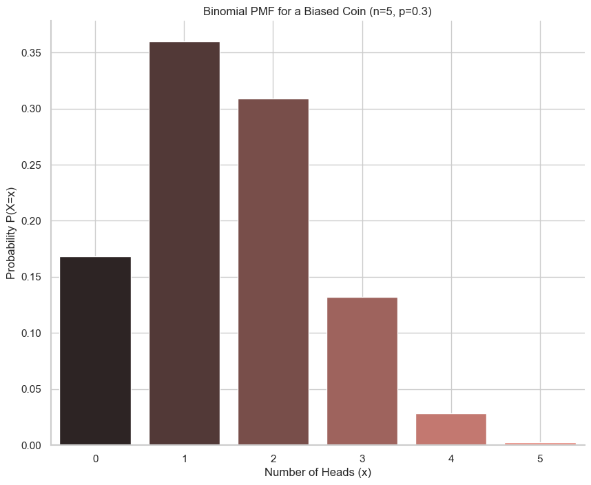

# The Binomial Coefficient

In the previous lesson, we saw that to calculate the probability of getting exactly *k* successes in *n* trials, we needed to know two things:
1.  The probability of a single, specific sequence (e.g., `HHTTT`).
2.  The number of different ways that sequence could occur.

This lesson focuses on the second part: how do we count the number of combinations?

## Counting Ordered Selections (Permutations)

Let's start with a related question: In how many ways can we pick *k* items from a set of *n* items if the **order matters**?

* For our first choice, we have `n` options.
* For our second choice, we have `n-1` remaining options.
* ...
* For our *k*-th choice, we have `n-k+1` remaining options.

The total number of ordered selections is the product: $n \times (n-1) \times \dots \times (n-k+1)$. This can be written more compactly as:
```math
\frac{n!}{(n-k)!}
```
<br>

## Correcting for Over-Counting (Combinations)

The formula above over-counts for our coin-flip problem because it treats `HHTTT` and `HTHTT` as different outcomes of picking "positions" for the heads, but we consider them the same *set* of positions.

We need to divide by the number of ways we can re-order the *k* items we've chosen. The number of ways to order *k* distinct items is **k!** (k-factorial).

This leads us to the **binomial coefficient**, which counts the number of ways to choose *k* items from a set of *n* in an **unordered** way.

> $$ \binom{n}{k} = \frac{n!}{k!(n-k)!} $$

This formula tells us exactly how many different sequences of coin flips will result in exactly *k* heads.

## Back to the Binomial PMF

Now we can see how the full Binomial PMF is constructed, even for a **biased coin**.

Let's say a coin has `P(Heads) = p`. We want to find the probability of getting exactly `x` heads in `n` flips.

1. **Probability of one sequence:** Any specific sequence with `x` heads and `n-x` tails (like `H...HT...T`) has a probability of:
```math
p^x (1-p)^{n-x}
```
<br>

2.  **Number of sequences:** The number of different ways to get `x` heads in `n` flips is given by the binomial coefficient:
```math
\binom{n}{x}
```
<br>

Combining these gives us the full PMF:
```math
P(X=x) = \binom{n}{x} p^x (1-p)^{n-x}
```
<br>

Let's visualize this for the biased coin example:

