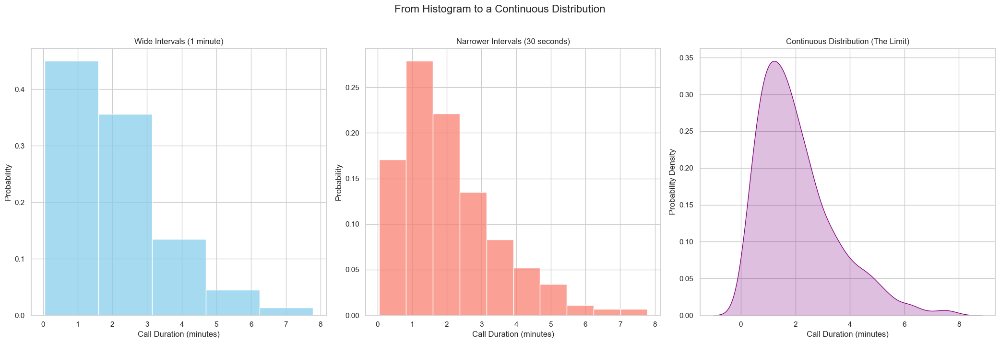

# Probability Distributions (Continuous)

Now that we know about discrete distributions, let's explore **continuous distributions**.

The key difference lies in the types of values the random variable can take:
* **Discrete:** The outcomes can be put in a list (e.g., number of heads: 0, 1, 2, 3...).
* **Continuous:** The outcomes can be any number within a given interval (e.g., the time you wait for a bus could be 1 minute, 1.01 minutes, or 1.2237... minutes).

### The Problem with Exact Points

For a continuous variable, the probability of it taking on any single, *exact* value is zero. For example, what is the probability that a support call lasts *exactly* 1 minute, to the infinitesimal decimal? Since there are infinitely many possible call durations, the probability of any one specific duration is effectively zero.

This means we can't use a Probability Mass Function (PMF) like we did for discrete variables, where we assigned a probability to each specific outcome.

## The Solution: Probabilities Over Intervals

Instead of asking for the probability of an exact point, we ask for the probability that the outcome falls **within a certain interval or window**.

For our call center example, we can ask:
* What is the probability that a call lasts between 0 and 1 minute?
* What is the probability that a call lasts between 1 and 2 minutes?

We can represent these probabilities with a histogram, where the area of the bars sums to 1. As we make our time intervals (the bins of the histogram) smaller and smaller, the histogram begins to look like a smooth curve.

## The Probability Density Function (PDF)

The smooth curve that emerges when our intervals become infinitely small is called a **Probability Density Function (PDF)**.

Unlike a PMF where the height of a bar is the probability, the height of the PDF curve is **not** a probability. It represents the "density" of probability at that point.

For continuous distributions, probability is not the height of the curve, but the **area under the curve** for a given interval.

> **Key Rule:** For a continuous probability distribution, the **total area under the PDF curve must equal 1**. The probability of an outcome falling within a certain range is the area under the curve in that range.