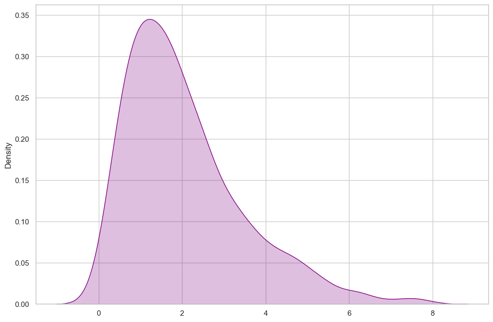

# The Probability Density Function

In discrete distributions, we can assign a specific probability to each possible outcome. For example, there is a specific probability of getting exactly 3 heads in 10 coin flips.

However, for a **continuous distribution**, the probability of the random variable taking on any single, exact value is **zero**. For example, the probability that a support call lasts *exactly* 2 minutes (2.000... seconds) is zero because there are infinitely many possible call durations.

This means we need a different way to think about probability for continuous variables. Instead of calculating the probability of an exact point, we calculate the probability of the outcome falling **within an interval**.

## From Histograms to a Continuous Curve

Let's revisit our call center example. We can start by creating a histogram where the bars represent the probability that a call's duration falls within a certain window (e.g., between 2 and 3 minutes). The total area of all the bars adds up to 1.

As we make these windows (or "bins") smaller and smaller, the histogram begins to resemble a smooth curve. This smooth curve is called the **Probability Density Function (PDF)**.  

## Understanding the PDF

The function that describes this curve is called the **Probability Density Function (PDF)**, often written as a lowercase `f(x)`. It is the continuous equivalent of the Probability Mass Function (PMF).

A crucial point to remember is that for a continuous variable, probability is **not** the height of the curve. The height represents the "density" or concentration of probability at that point.

> **Rule:** The probability that a continuous random variable `X` falls between two values `a` and `b` is the **area under the PDF curve** between `a` and `b`.

### Properties of a Valid PDF

A function `f(x)` must satisfy three conditions to be considered a valid PDF:
1.  **It must be defined for all real numbers.** (It can be zero for many values, for example, the probability of a negative call duration is zero).
2.  **It must be non-negative everywhere.** $f(x) \ge 0$. This makes sense, as we cannot have negative probabilities.
3.  **The total area under the entire curve must be equal to 1.** This represents the certainty that the outcome will be *some* value.

## Summary: Discrete vs. Continuous

| Aspect | Discrete Random Variable | Continuous Random Variable |
| :--- | :--- | :--- |
| **Possible Values** | A countable list (e.g., 0, 1, 2...) | An uncountable interval (e.g., all numbers between 0 and 5) |
| **Probability Function**| **Probability Mass Function (PMF)**, `p(x)` | **Probability Density Function (PDF)**, `f(x)` |
| **How to find P(X=x)?**| `p(x)` (The height of the bar) | **0** |
| **How to find P(a ≤ X ≤ b)?**| Sum the heights of the bars from `a` to `b` | Find the **area under the curve** from `a` to `b` |