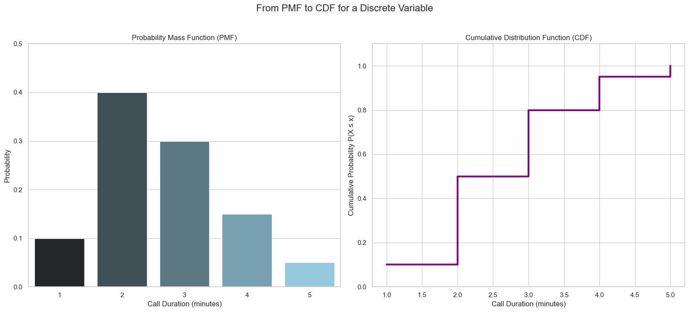
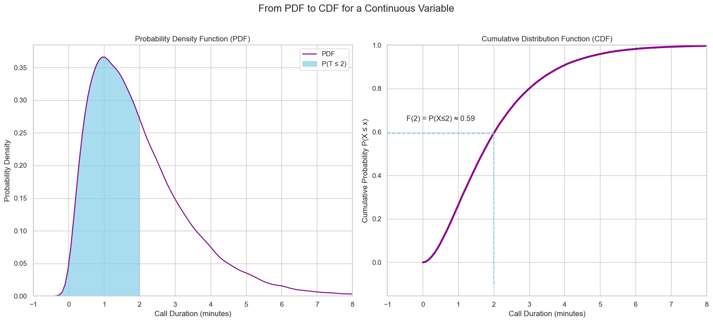

# The Cumulative Distribution Function (CDF)

So far, we've learned about the **Probability Mass Function (PMF)** for discrete distributions and the **Probability Density Function (PDF)** for continuous distributions. While powerful, using a PDF requires calculating the area under a curve to find probabilities, which can be inconvenient.

The **Cumulative Distribution Function (CDF)** offers a more direct way to get probabilities.

> The **CDF**, denoted as a capital `F(x)`, tells you the probability that a random variable `X` will take on a value **less than or equal to** a certain value `x`.
> $$ F(x) = P(X \le x) $$

The CDF essentially "accumulates" probability as you move from left to right along the number line.

---
## The CDF for Discrete Distributions

Let's start with a discrete example. Imagine the probability distribution for the duration of a support call, grouped into 1-minute intervals. The CDF at any point is the sum of all the probabilities up to that point.

* `F(1)` = P(call ≤ 1 min) = `P(0-1 min)`
* `F(2)` = P(call ≤ 2 min) = `P(0-1 min) + P(1-2 min)`
* `F(5)` = P(call ≤ 5 min) = `1` (since all calls are 5 minutes or less)

For discrete variables, the CDF is a "step function." It is flat between values and then "jumps" up at each possible outcome. The height of each jump is equal to the probability of that specific outcome.

---

## The CDF for Continuous Distributions

For a continuous distribution, the CDF has a similar meaning, but it's calculated differently. The value of the CDF at a point `x`, `F(x)`, is the **total area under the PDF curve** from the beginning of the range up to `x`.

This is a powerful concept. Instead of having to calculate a new area (an integral) every time we want a probability, we can use the CDF. The probability of an outcome falling between `a` and `b` is simply the difference between the CDF values at those points:
$$ P(a \le X \le b) = F(b) - F(a) $$

Because there are no "jumps" in a continuous distribution (the probability of any single point is zero), the CDF is a smooth, non-decreasing curve.

---

## Properties of a Valid CDF

A function `F(x)` must satisfy four conditions to be a valid CDF:
1.  **It must be non-decreasing.** As `x` increases, the accumulated probability can only stay the same or increase; it can never go down.
2.  **The values must be between 0 and 1.** Since it represents a probability, it cannot be negative or greater than one.
3.  **The left endpoint must be 0.** As $x \to -\infty$, $F(x) \to 0$.
4.  **The right endpoint must be 1.** As $x \to \infty$, $F(x) \to 1$.