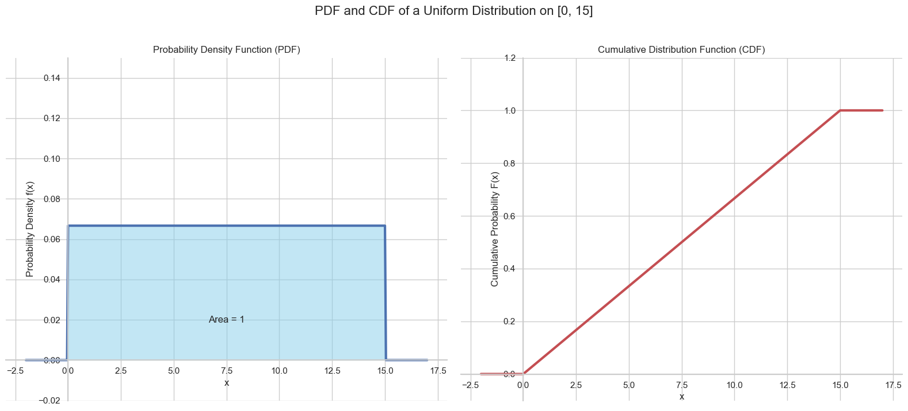

# The Uniform Distribution

The simplest continuous distribution is the **Uniform Distribution**.

A random variable follows a uniform distribution if all possible outcomes within a given interval are **equally likely**.

**Analogy: Waiting for the Bus**  
Imagine a bus that arrives exactly every 10 minutes, but you don't know the schedule. If you show up at a random moment, your wait time could be 1 minute, 5 minutes, 9.7 minutes, or any other value between 0 and 10. Since you arrived randomly, any wait time in that interval is equally probable. This is a uniform distribution.

## The Probability Density Function (PDF)

Because every outcome in the interval is equally likely, the PDF of a uniform distribution is a simple **horizontal line** (a constant value) over that interval, and zero everywhere else.

Let's consider a support call center where the wait time `T` is uniformly distributed between 0 and 15 minutes. The PDF would look like a rectangle.

What is the height of this rectangle? Remember, the total area under any PDF must be **1**.
* The width of our rectangle is the length of the interval: $15 - 0 = 15$.
* Therefore, `Height × Width = 1` must be true.
* `Height × 15 = 1`, which means `Height = 1/15`.

In general, for a uniform distribution over the interval `[a, b]`...  

**Uniform PDF:**
```math
f(x) =
\begin{cases}
\frac{1}{b-a} & \text{if } a \le x \le b \\
0 & \text{otherwise}
\end{cases}
```
<br>


## The Cumulative Distribution Function (CDF)

The CDF, `F(x)`, represents the accumulated probability up to a certain value `x`. For a uniform distribution, this is the area of the rectangle from the start of the interval `a` up to `x`.

Let's consider a simple uniform distribution on the interval `[0, 1]`. The PDF is a rectangle with a height of 1.
* For any `x < 0`, the accumulated area is **0**.
* For any `x > 1`, we have accumulated the entire area, so the CDF is **1**.
* For any `x` between 0 and 1, the area is a rectangle with width `x` and height `1`, so the area is simply `x`.

This results in a CDF that is a straight line ramping up from 0 to 1 over the interval.

For the general case on an interval `[a, b]`...

**Uniform CDF:**. 
```math
F(x) =
\begin{cases}
0 & \text{if } x < a \\
\frac{x-a}{b-a} & \text{if } a \le x \le b \\
1 & \text{if } x > b
\end{cases}
```
<br>




---

**Next:** [The Normal Distribution](./10_normal_distribution.md)