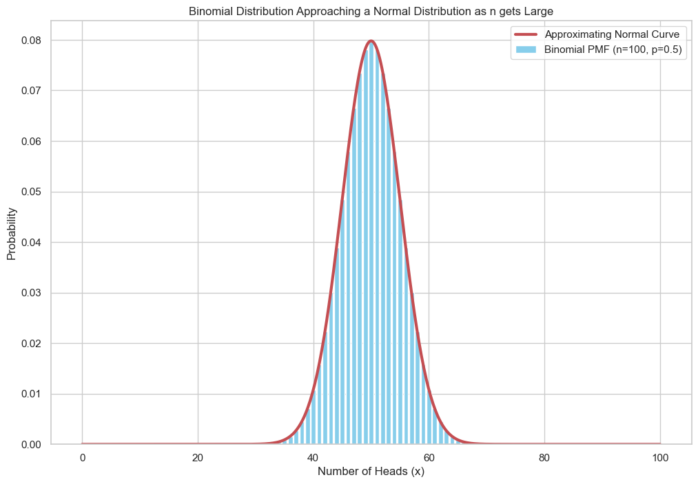
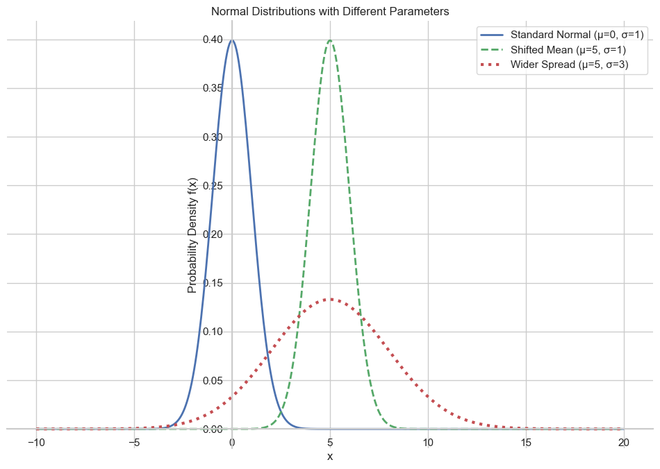

# The Normal Distribution

Now we will learn about one of the most popular and important distributions in all of statistics and machine learning: the **Normal Distribution**, also known as the **Gaussian Distribution** or the "bell curve."

It appears everywhere in science and real life. One of the reasons for this is that when we add up many independent random processes, their combined effect tends to follow a normal distribution.

### From Binomial to Normal
A great way to build intuition for the normal distribution is to see it as a limit of the **binomial distribution**. Recall that the binomial distribution models the number of heads in *n* coin tosses.

As the number of coin tosses (`n`) gets very large, the shape of the binomial distribution's histogram begins to look more and more like a smooth, continuous bell curve. This bell curve is the normal distribution.



## The Normal PDF and its Parameters

The Probability Density Function (PDF) for the normal distribution is a bit more complex, but it is controlled by two simple parameters:

* **The Mean ($\mu$):** This parameter controls the **center** of the bell curve.
* **The Standard Deviation ($\sigma$):** This parameter controls the **spread** or "wideness" of the bell curve. A small `σ` gives a tall, skinny curve, while a large `σ` gives a short, wide curve.

**The Normal PDF Formula:**  
```math
f(x) = \frac{1}{\sigma\sqrt{2\pi}} e^{ -\frac{1}{2}\left(\frac{x-\mu}{\sigma}\right)^2 }
```
<br>

The first part of the formula, $\frac{1}{\sigma\sqrt{2\pi}}$, is a scaling constant that ensures the total area under the curve is exactly 1. The important part is the exponential term, which creates the characteristic bell shape centered at `μ` and scaled by `σ`.  



## The Standard Normal Distribution

One particular set of parameters is of great importance: **μ = 0** and **σ = 1**. This is called the **Standard Normal Distribution**.

We can convert any normal random variable `X` into a standard normal variable `Z` using a process called **standardization**:
```math
Z = \frac{X - \mu}{\sigma}
```
<br>

This `Z-score` tells us how many standard deviations an observation `X` is away from the mean `μ`. Standardization is a crucial technique in statistics and machine learning for comparing variables on different scales.

## The Cumulative Distribution Function (CDF)

The CDF of the normal distribution, which gives the area under the curve up to a certain point, does not have a simple formula. In the past, people used large tables of data to look up these values. Today, we use software to calculate them.

## Real-World Examples

The great thing about the normal distribution is that it models so many real-world phenomena, especially variables that are the sum of many small, independent processes:
* Heights and weights of a population
* IQ scores
* Measurement errors in experiments
* Noise in a communication channel


---

**Next:** [The Chi-Squared Distribution](./11_chi-squared_distribution.md)