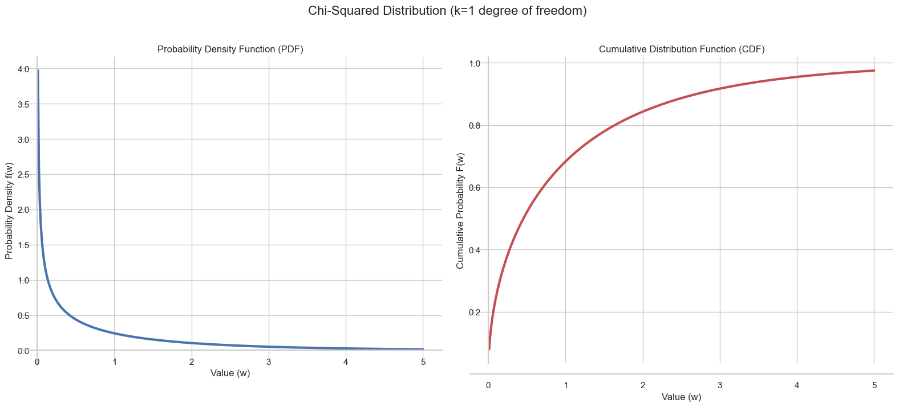
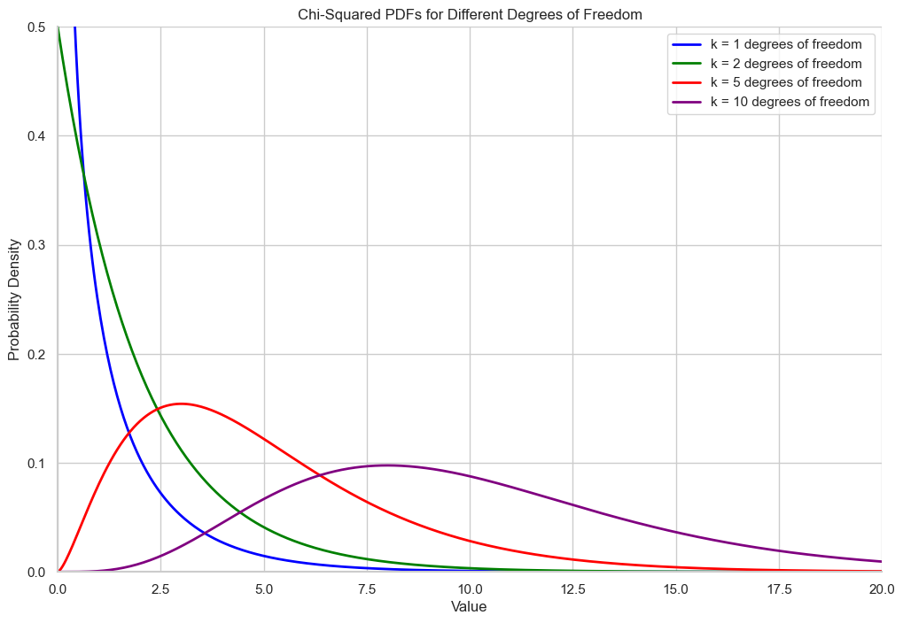

# The Chi-Squared Distribution

Let's explore a very important continuous distribution that arises from the normal distribution: the **Chi-Squared ($\chi^2$) Distribution**.

### Motivating Example: Signal Noise Power

Imagine you are transmitting a digital signal. The signal is affected by random **noise**, which we can model as a random variable `Z`. It's a very common assumption in communications and science that this noise follows a **standard normal distribution** (`μ=0, σ=1`).

While the noise `Z` can be positive or negative, we are often interested in its **power**, which is proportional to the square of the noise, $W = Z^2$. Since `Z` is a random variable, `W` is also a random variable. The key question is: what is the probability distribution of this "noise power" `W`?

This new distribution is called the **Chi-Squared distribution with one degree of freedom**.

## The Chi-Squared Distribution (1 Degree of Freedom)

A Chi-Squared distribution with **one degree of freedom** is defined as the distribution of a single standard normal random variable squared ($Z^2$).

Because we are squaring the values, the resulting distribution has some interesting properties:
* It is always non-negative.
* It is highly right-skewed, because the normal distribution concentrates most of its probability around zero. Small values of `Z` (both positive and negative) become small positive values of `W`, while large values of `Z` become very large positive values of `W`.



## Generalizing to 'k' Degrees of Freedom

What if we want to find the total noise power accumulated over *k* independent transmissions? This would be the sum of *k* squared standard normal variables:
```math
W = Z_1^2 + Z_2^2 + \dots + Z_k^2
```
<br>

The distribution of this new variable `W` is a **Chi-Squared distribution with *k* degrees of freedom**.

The number of **degrees of freedom** is the number of independent standard normal variables that you are summing. As the degrees of freedom (`k`) increase, the shape of the distribution changes: it becomes less skewed and starts to look more symmetric and bell-shaped.




---

**Next:** [Sampling from a Distribution](./12_sampling_from_a_distribution.md)