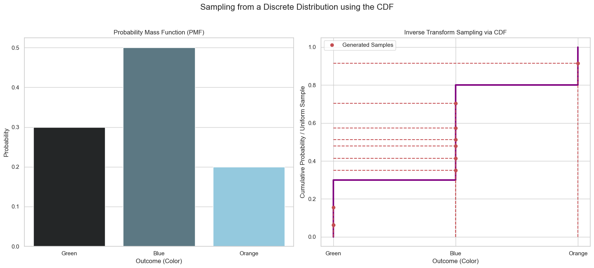
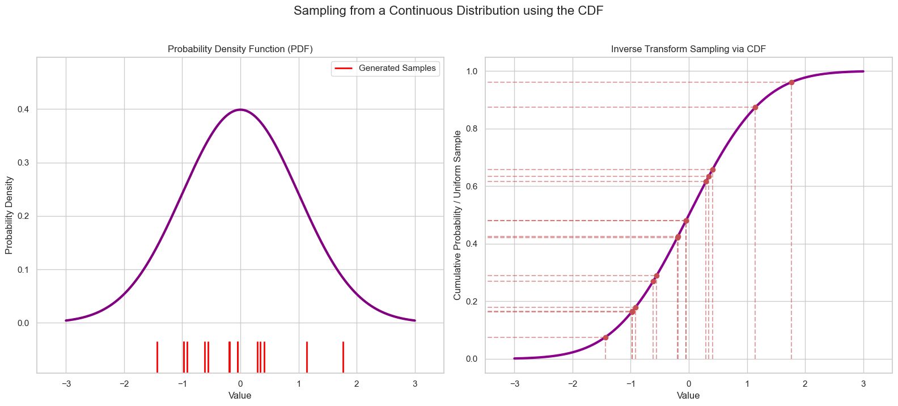

# Sampling from a Distribution

Imagine you have a dataset, but you need more data for your analysis or model training. If you can't collect new real-world data, you can create **synthetic data** that follows the same patterns as your original data.

The process of generating these new data points is called **sampling from a probability distribution**. The goal is to pick random points in a way that the frequency of each outcome matches the probabilities defined by the distribution.

## Sampling from a Discrete Distribution

Let's say we have a simple discrete distribution for three colors:
* `P(Green) = 0.3`
* `P(Blue) = 0.5`
* `P(Orange) = 0.2`

How can we randomly pick a color that respects these probabilities? A clever way is to use the **Cumulative Distribution Function (CDF)**.

1.  We can represent the probabilities as segments on a line from 0 to 1. The length of each segment corresponds to its probability.
2.  We generate a random number uniformly between 0 and 1.
3.  We see which segment our random number falls into and select the corresponding color.

This method, known as **Inverse Transform Sampling**, is visualized below. By sampling uniformly from the vertical y-axis and mapping back to the x-axis using the CDF, we generate samples that follow the original distribution.

## Sampling from a Continuous Distribution

The same beautiful principle works for continuous distributions. It's difficult to sample directly from a complex curve like a normal distribution, but it's easy to sample uniformly from the interval `[0, 1]`.

1.  Generate a set of random numbers uniformly between 0 and 1 on the y-axis.
2.  For each random number, find where it intersects the CDF curve.
3.  The x-coordinate of that intersection is our new data point.

This process will generate new data points that perfectly follow the original Probability Density Function (PDF). Notice how the denser regions of the PDF correspond to the steeper parts of the CDF. This means that a uniform sampling on the y-axis will naturally produce more data points in those dense regions on the x-axis.

---

**Next:** [Expected Value (Mean)](../03_describing_distributions/01_expected_value--mean.md)