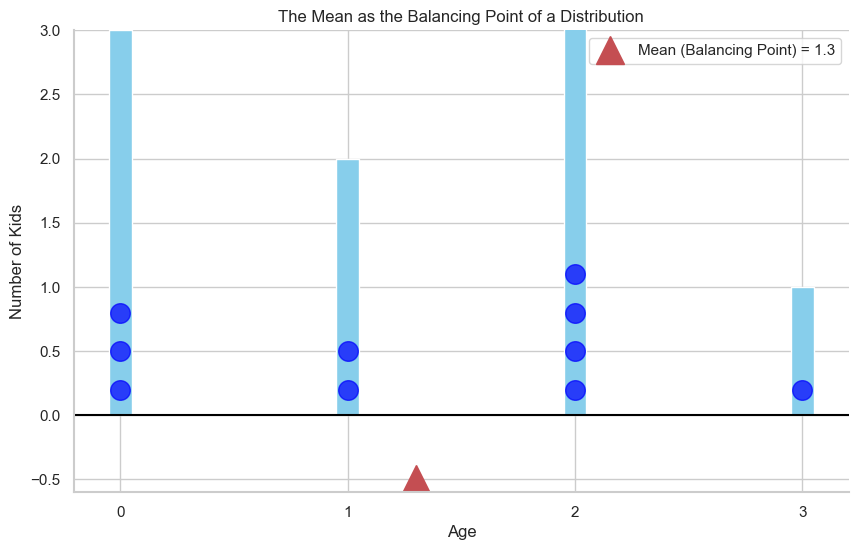

# Expected Value (Mean)

In this module, we will explore one of the most important concepts for describing a probability distribution: the **mean**, or as it's more formally known in probability, the **Expected Value**.

The expected value represents the "center of mass" or the **balancing point** of a distribution. It's the long-run average value we would expect to get if we were to repeat an experiment many times.

Let's start with an intuitive example.

**Scenario:** We have a sample of 10 kids with the following ages:
* 3 kids are age 0
* 2 kids are age 1
* 4 kids are age 2
* 1 kid is age 3

If we were to represent each kid as a ball on a scale, the mean would be the point where the scale balances perfectly.

To calculate this, we find the average age:
```math
\text{Mean} = \frac{(3 \times 0) + (2 \times 1) + (4 \times 2) + (1 \times 3)}{10} = \frac{0 + 2 + 8 + 3}{10} = \frac{13}{10} = 1.3
```
<br>

The average age is 1.3 years.

We can rewrite this calculation in a way that highlights the probabilities:
```math
\text{Mean} = (0 \cdot \frac{3}{10}) + (1 \cdot \frac{2}{10}) + (2 \cdot \frac{4}{10}) + (3 \cdot \frac{1}{10}) = 1.3
```
<br>

This is a **weighted average** of the ages, where each age is weighted by its probability of occurring. This is the definition of the expected value.



## Expected Value in Decision Making

The concept of expected value is very useful for making decisions under uncertainty.

**Scenario:** A friend offers you a game. You flip a fair coin. If it's heads, you win 10 dollars. If it's tails, you win nothing.

**Question:** What is a fair price to pay to play this game?

To answer this, we can calculate the **expected payoff**.
* You have a 50% chance of winning 10 dollars.
* You have a 50% chance of winning 0 dollars.

The expected value `E(X)` is the weighted average of the outcomes:
```math
E(X) = (10 \text{ dollars} \cdot 0.5) + (0 \text{ dollars} \cdot 0.5) = 5 \text{ dollars}
```
<br>

On average, you can expect to win 5 dollars each time you play. Therefore, 5 dollars is the highest amount you should be willing to pay.

## The Formal Definition (Discrete Case)

If you have a discrete random variable `X` with a probability mass function `p(x)`, the expected value is the sum of each possible value multiplied by its probability.

**Expected Value (Discrete):**  
> $$ E[X] = \sum x \cdot p(x) $$

## Expected Value for Continuous Variables

The concept is the same for continuous random variables: the expected value is still the "balancing point" of the distribution. However, instead of summing a finite number of values, we have to use an integral to calculate the weighted average over a continuous interval.

**Expected Value (Continuous):**  
> $$E[X] = \int_{-\infty}^{\infty} x \cdot f(x) \,dx$$

**Intuition:**
Just like the discrete version, this is a **weighted average**. The integral "sums up" all the possible values of `x`, where each `x` is weighted by its probability density `f(x)`.

While we won't focus on the integral calculation, the visual intuition remains the same. For a symmetric distribution like the uniform distribution, the mean is simply the center point. For a skewed distribution, the mean is the point that would balance the entire shape.

## A Common Misconception: Mean vs. Median

It's natural to think that the mean is the point where the data is split in half (50% on one side, 50% on the other). That point is actually called the **median**.

The mean is the **balancing point**. This means that in a skewed distribution, a few extreme values far from the center can "pull" the mean in their direction, just like a small mouse can balance a heavy elephant if it's placed far enough away on a seesaw.