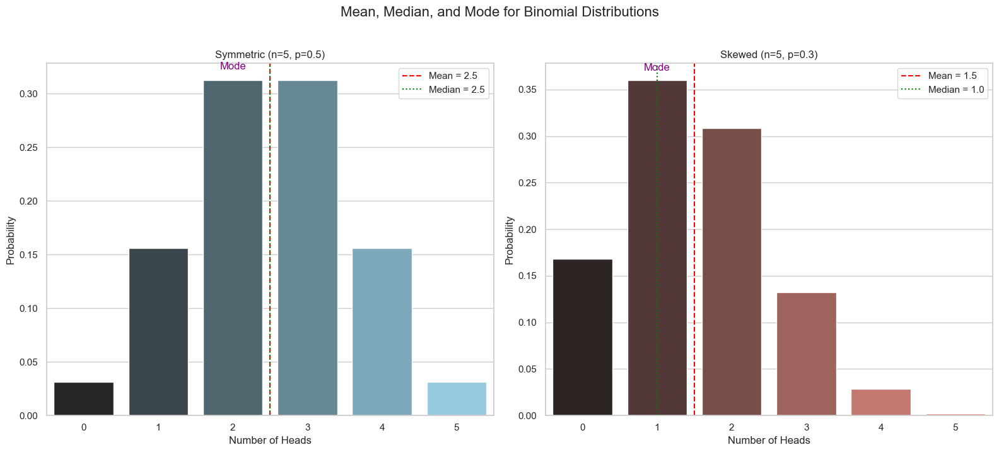
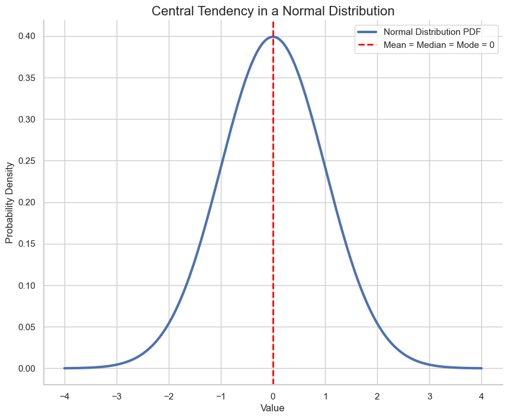

# Other Measures of Central Tendency: Median and Mode

In the last lesson, we learned about the expected value, or **mean**, as a measure of the center of a distribution. However, the mean is not always the best measure, as it can be heavily influenced by extreme outliers.

### The Michael Jordan Effect
A famous example illustrates this problem. In the 1980s, the average starting salary for a geography graduate at the University of North Carolina was reported to be around 250,000 dollars, while the national average was only 22,000 dollars.

Why the huge difference? It's because one graduate from that program, Michael Jordan, had an exceptionally high starting salary. His single, massive salary (an **outlier**) pulled the average up for everyone else, giving a misleading picture of what a typical graduate earned.

The mean is the balancing point of the data. An extreme outlier acts like a heavy weight placed far out on a seesaw, forcing the balancing point to shift significantly.

## The Median: The True Middle

When our data has extreme outliers, the **median** is often a better measure of the central tendency.

> The **median** is the middle value in a dataset that has been sorted in order. It's the point where 50% of the data is smaller and 50% is larger.

Because it's based on position, not value, the median is not affected by extreme outliers. Michael Jordan is just one person in the sorted list, so his huge salary doesn't change the middle position.

*(Note: If a dataset has an even number of points, the median is the average of the two middle values.)*

## The Mode: The Most Frequent Value

The third measure of central tendency is the **mode**.

> The **mode** is the value that appears most frequently in a dataset.

In a probability distribution, the mode is the outcome with the highest probability.
* For a discrete distribution, it's the tallest bar in the histogram.
* For a continuous distribution, it's the peak of the PDF curve.

A distribution can have more than one mode (multimodal), or if all outcomes are equally likely (like a uniform distribution), every value can be considered a mode.

## Comparing Mean, Median, and Mode

Let's see how these three measures compare for different binomial distributions.

## Central Tendency in the Normal Distribution

For a **normal distribution**, which is perfectly symmetric, the situation is very simple:
> **The mean, median, and mode are all the exact same value**, located at the center and peak of the bell curve.

---

**Next:** [Expected Value of a Function](./03_expected_value_of_a_function.md)