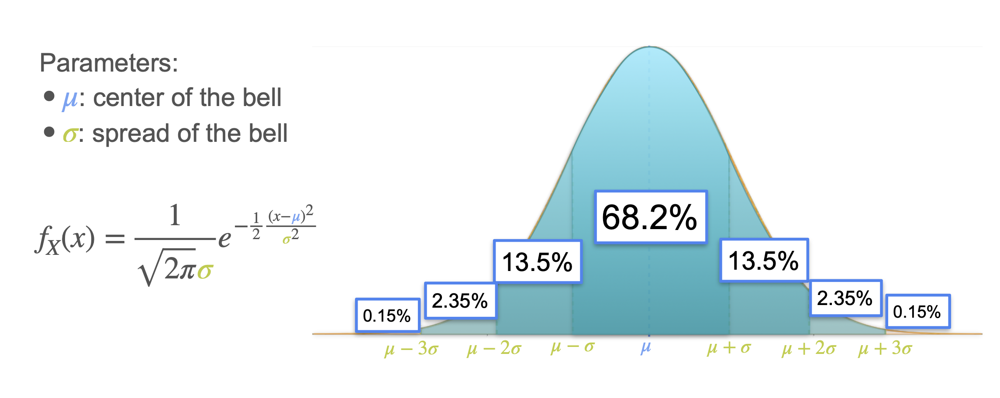

# Standard Deviation

While **variance** is a powerful measure of a distribution's spread, it has one practical drawback: its units.

If you are measuring the heights of people in meters, the mean will also be in meters, but the variance will be in **meters squared**. This makes it difficult to intuitively understand the spread in the context of the original data.

The solution is simple: we take the square root of the variance. This new measure is called the **standard deviation**.

**Definition:** The **standard deviation**, denoted as `σ` (sigma), is the square root of the variance.

```math
\sigma = \sqrt{\text{Var}(X)}
```
<br>

The standard deviation measures the typical or "standard" distance of a data point from the mean, and it is always in the **same units** as the original data.

## The Standard Deviation and the Normal Distribution

The standard deviation is especially useful for interpreting the **normal distribution**. The shape of the bell curve is defined by its mean (`μ`) and its standard deviation (`σ`).

A key visual cue for the standard deviation is the **inflection point**—the point where the curve changes from being concave down to concave up. These points are located exactly one standard deviation away from the mean, at `μ - σ` and `μ + σ`.

## The Empirical Rule (68-95-99.7 Rule)

For any normal distribution, a predictable percentage of the data lies within a certain number of standard deviations from the mean.

* Approximately **68%** of the data falls within **1** standard deviation of the mean (`μ ± 1σ`).
* Approximately **95%** of the data falls within **2** standard deviations of the mean (`μ ± 2σ`).
* Approximately **99.7%** of the data falls within **3** standard deviations of the mean (`μ ± 3σ`).

This is a powerful rule of thumb for quickly understanding the spread of normally distributed data.

