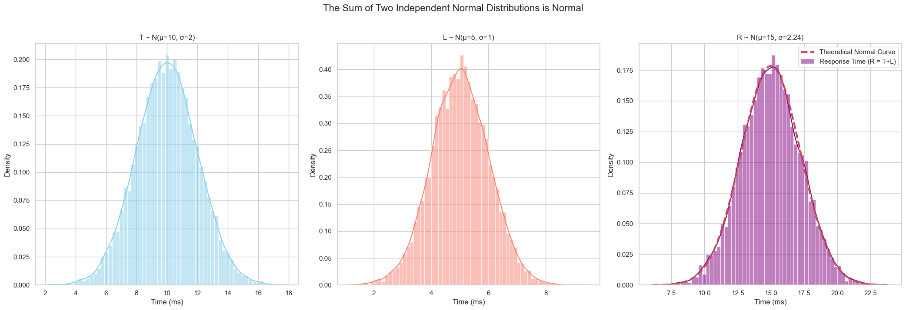

# The Sum of Independent Gaussian (Normal) Variables

An incredibly useful property of the normal distribution is that the sum of two independent normal random variables is itself a normal random variable. This allows us to easily model complex systems where the total outcome is the sum of several independent, random processes.

### Motivating Example: System Response Time

Imagine we are studying the total response time of a computer system. This total time is the sum of two independent components:
1.  **Processing Time (T):** The time the system takes to process a task. Let's model this as a normal distribution with a mean of 10ms and a standard deviation of 2ms.
2.  **Network Latency (L):** The delay from network communication. Let's model this as a normal distribution with a mean of 5ms and a standard deviation of 1ms.

The **Total Response Time (R)** is the sum of these two variables: `R = T + L`.

The key question is: what is the distribution of `R`?

## Rules for Summing Independent Gaussians

If `T` and `L` are independent normal random variables, their sum `R` will also be a normal random variable. We can find its parameters with two simple rules:

1.  **The mean of the sum is the sum of the means.**
```math
\mu_R = \mu_T + \mu_L
```
<br>

2.  **The variance of the sum is the sum of the variances.** (This is only true for independent variables).
```math
\sigma_R^2 = \sigma_T^2 + \sigma_L^2
```
<br>

From the variance rule, we can find the new standard deviation:
```math
\sigma_R = \sqrt{\sigma_T^2 + \sigma_L^2}
```
<br>

For our example:
* **New Mean:** $\mu_R = 10 + 5 = 15$ ms
* **New Variance:** $\sigma_R^2 = 2^2 + 1^2 = 4 + 1 = 5$
* **New Standard Deviation:** $\sigma_R = \sqrt{5} \approx 2.24$ ms

Let's verify this with a simulation:



## General Rule for Linear Combinations

This rule can be generalized for any linear combination of two independent normal random variables, `X` and `Y`.

If $X \sim N(\mu_X, \sigma_X^2)$ and $Y \sim N(\mu_Y, \sigma_Y^2)$, then for any constants `a` and `b`, the new variable `Z = aX + bY` also follows a normal distribution.

> **Parameters for Z = aX + bY:**
> * **Mean:** $ \mu_Z = a\mu_X + b\mu_Y $
> * **Variance:** $ \sigma_Z^2 = a^2\sigma_X^2 + b^2\sigma_Y^2 $