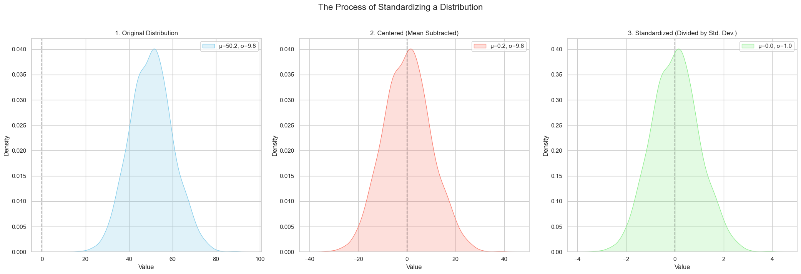

# Standardizing a Distribution

When working with data, it's often convenient to transform a distribution into a "standard" form. Standardization is a process that shifts and scales a distribution so that it has a **mean of 0** and a **standard deviation of 1**. This is a very common and important preprocessing step in data science and machine learning.

The process involves two steps: **centering** and **scaling**.

## Step 1: Centering the Distribution (Mean = 0)

If we have a random variable `X` with a mean `μ`, we can create a new random variable with a mean of 0 by simply subtracting `μ` from every value.

> X_centered = X - μ

**Why this works (Linearity of Expectation):**
We know that the expected value is a linear operator.
```math
E[X - \mu] = E[X] - E[\mu]
```
<br>

Since `μ` is the expected value of `X`, and the expected value of a constant is just the constant itself, we get:
```math
= \mu - \mu = 0
```
<br>

## Step 2: Scaling the Distribution (Standard Deviation = 1)

Now that our distribution is centered, we can adjust its spread. If our centered variable has a standard deviation of `σ`, we can create a new variable with a standard deviation of 1 by dividing every value by `σ`.

> X_scaled = X_centered / σ

**Why this works (Properties of Variance):**
We know that for a constant `c`, `Var(cX) = c²Var(X)`. In our case, the constant is `1/σ`.
```math
\text{Var}(\frac{X}{\sigma}) = (\frac{1}{\sigma})^2 \text{Var}(X) = \frac{1}{\sigma^2} \cdot \sigma^2 = 1
```
<br>

Since the variance is 1, the standard deviation (which is the square root of the variance) is also 1.

## The Full Standardization Process

To standardize a distribution, we combine these two steps. Given a random variable `X` with mean `μ` and standard deviation `σ`, its standardized version `Z` is:

```math
Z = \frac{X - \mu}{\sigma}
```
<br>

The resulting variable `Z` will always have a mean of 0 and a standard deviation of 1. This process is crucial in statistics because it allows us to compare variables that are measured on different scales.

