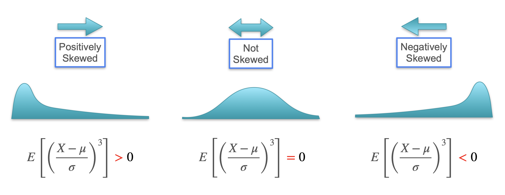

# Skewness

Now let's explore how we can use higher-order moments to describe more subtle features of a distribution's shape. The **third moment** is used to calculate **skewness**.

We've learned that the mean tells us the center of a distribution, and the variance tells us its spread. However, two distributions can have the exact same mean and variance but be vastly different.

Let's consider two scenarios:  

1.  **The Lottery:** You pay 1 dollar for a ticket. You have a 1% chance to win 100 dollars (a net gain of 99 dollars) and a 99% chance to win nothing (a net loss of 1 dollar).
2.  **The Car Insurance Company:** You sell one insurance policy for 1 dollar. There is a 1% chance the client has an accident, costing you 100 dollars (a net loss of 99 dollars), and a 99% chance they don't, leaving you with a 1 dollar profit.

Let's calculate the mean (1st moment) and variance (2nd moment) for both random variables.

#### Expected Value (Mean):
* $E[X_1] = (-1 \cdot 0.99) + (99 \cdot 0.01) = -0.99 + 0.99 = 0$
* $E[X_2] = (-99 \cdot 0.01) + (1 \cdot 0.99) = -0.99 + 0.99 = 0$
* **Result:** The means are identical.  

#### Variance:
* Since the mean is 0, the variance is just the second moment, $E[X^2]$.
* $E[X_1^2] = ((-1)^2 \cdot 0.99) + (99^2 \cdot 0.01) = (1 \cdot 0.99) + (9801 \cdot 0.01) = 0.99 + 98.01 = 99$
* $E[X_2^2] = ((-99)^2 \cdot 0.01) + (1^2 \cdot 0.99) = (9801 \cdot 0.01) + (1 \cdot 0.99) = 98.01 + 0.99 = 99$
* **Result:** The variances are also identical.  

The mean and variance failed to tell these two very different scenarios apart. We need a higher moment.

## The Third Moment and Skewness

Let's calculate the **third moment**, $E[X^3]$.
* $E[X_1^3] = ((-1)^3 \cdot 0.99) + (99^3 \cdot 0.01) = (-1 \cdot 0.99) + (970299 \cdot 0.01) \approx 9702$
* $E[X_2^3] = ((-99)^3 \cdot 0.01) + (1^3 \cdot 0.99) = (-970299 \cdot 0.01) + (0.99) \approx -9702$

The third moment finally reveals the difference! The large positive value for the lottery is due to the small chance of a very large positive outcome. The large negative value for the insurance is due to the small chance of a very large negative outcome.

**Skewness** is the standardized third moment. It measures the asymmetry of a distribution.
```math
\text{Skewness} = E \left[ \left(\frac{X - \mu}{\sigma}\right)^3 \right]
```
<br>

* **Positive Skewness (Right Skew):** The distribution has a long tail to the right. The lottery is an example.
* **Negative Skewness (Left Skew):** The distribution has a long tail to the left. The insurance example.
* **Zero Skewness:** The distribution is perfectly symmetric (like the normal distribution).




---

**Next:** [Kurtosis](./11_kurtosis.md)