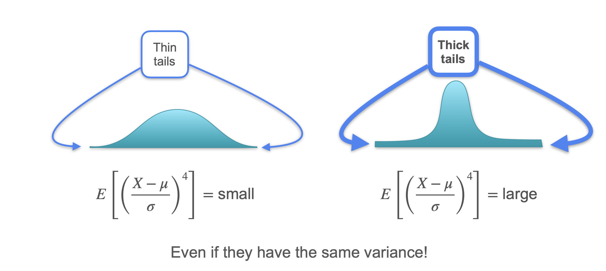

# Kurtosis

Now that we've learned about the mean, variance, and skewness, let's look at a scenario where even these three measures are not enough to tell two different distributions apart. This will introduce our fourth and final measure: **kurtosis**.

Let's consider two different games:

* **Game 1:** You flip a fair coin. Heads, you win 1 dollar. Tails, you lose 1 dollar.
* **Game 2:** A more complex game with four outcomes:
    * Win 0.10 dollars (Prob: 100/202 ≈ 49.5%)
    * Lose 0.10 dollars (Prob: 100/202 ≈ 49.5%)
    * Win 10 dollars (Prob: 1/202 ≈ 0.5%)
    * Lose 10 dollars (Prob: 1/202 ≈ 0.5%)

Game 2 seems less risky because you usually win or lose only 10 cents. However, it has a small chance of a very large win or loss. Which game is riskier? To answer this, we need to analyze their distributions.

## Comparing the First Three Moments

These two games are clearly different. But can we tell them apart with our statistical measures?

#### Expected Value (Mean):
Both distributions are perfectly symmetric around 0. Therefore, the **mean for both is 0**.  

#### Variance (Related to the Second Moment):
Let's calculate the variance for each game. Since the mean is 0, the variance is just $E[X^2]$.

* $Var(X_1) = ((-1)^2 \cdot 0.5) + ((1)^2 \cdot 0.5) = 1$
* $Var(X_2) = ((-10)^2 \cdot 1/202) + ((-0.1)^2 \cdot 100/202) + ((0.1)^2 \cdot 100/202) + ((10)^2 \cdot 1/202) = (100/202) + (1/202) + (1/202) + (100/202) = 202/202 = 1$

Believe it or not, the **variance for both is 1**. According to this measure, neither game is riskier than the other.  

#### Skewness (Related to the Third Moment):
Both distributions are perfectly symmetric. Therefore, the **skewness for both is 0**.

The first three moments have failed to distinguish between these two different games. We need to go to a higher moment.

## The Fourth Moment and Kurtosis

Let's calculate the **fourth moment**, $E[X^4]$.

* $E[X_1^4] = ((-1)^4 \cdot 0.5) + (1^4 \cdot 0.5) = 1$

* $E[X_2^4] = ((-10)^4 \cdot 1/202) + ((-0.1)^4 \cdot 100/202) + \dots \approx 99.01$

The fourth moment is finally different, and it's much larger for Game 2. This is because the extreme values (`-10` and `10`), when raised to the fourth power, have a huge impact on the calculation, even though their probabilities are small.

**Kurtosis** is the standardized fourth moment. It measures the "tailedness" of a distribution—how much of its variance is due to infrequent, extreme outliers.
```math
\text{Kurtosis} = E \left[ \left(\frac{X - \mu}{\sigma}\right)^4 \right]
```
<br>

* **Low Kurtosis (Thin Tails):** The distribution's variance comes from frequent, modest deviations from the mean (like Game 1).
* **High Kurtosis (Thick/Heavy Tails):** The distribution's variance is driven by rare, extreme outliers (like Game 2).




---

**Next:** [Quantiles](./12_quantiles.md)