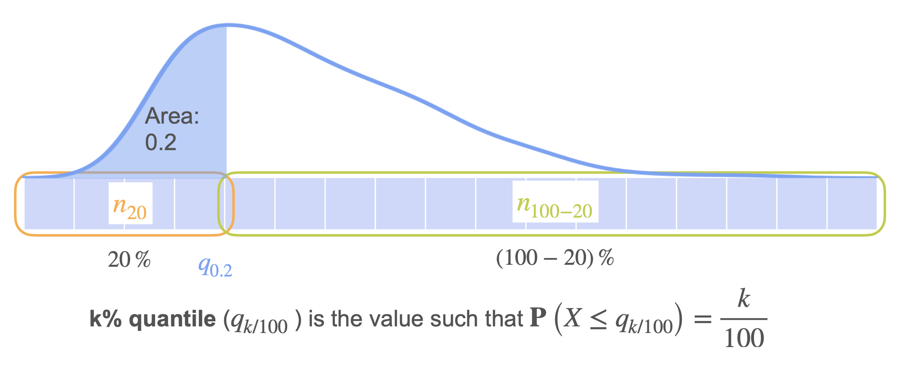

# Quantiles

While we have numerical ways to describe a distribution (like mean, variance, etc.), it's also incredibly important to be able to visualize it. In this lesson, we will learn about **quantiles**, which are points that divide a dataset into equal-sized, continuous portions.

Let's use a dataset of 12 data points:

**Data (Unsorted):** `{18.3, 18.4, 23.2, 51.2, 35.2, 29.7, 75, 8.7, 65.9, 14.2, 54.7, 25.9}`

First, we must sort the data in increasing order:
**Data (Sorted):** `{8.7, 14.2, 18.3, 18.4, 23.2, 25.9, 29.7, 35.2, 51.2, 54.7, 65.9, 75.0}`

* **Median (The 50% Quantile or 2nd Quartile, Q2):**
    * This is the point that splits the data in half. Since we have 12 points, the median is the average of the two middle values (the 6th and 7th): `(25.9 + 29.7) / 2 = 27.8`.  

* **First Quartile (The 25% Quantile, Q1):**
    * This is the value where 25% of the data is smaller. It's the median of the first half of the data (the first six points): `(18.3 + 18.4) / 2 = 18.35`.  

* **Third Quartile (The 75% Quantile, Q3):**
    * This is the value where 75% of the data is smaller. It's the median of the second half of the data (the last six points): `(51.2 + 54.7) / 2 = 52.95`.

These three quartiles, along with the minimum and maximum values, form the **five-number summary** of a dataset, which is perfectly visualized by a **box plot**.

## Quantiles and Continuous Distributions

The concept of a quantile can be extended to continuous probability distributions.

The **k-th percentile quantile** is the value `q` such that the probability of the random variable `X` being less than or equal to `q` is exactly `k%`.

```math
P(X \le q_k) = \frac{k}{100}
```
<br>

Geometrically, this means that the **area under the PDF curve** to the left of the quantile `q` is equal to `k/100`. This is the same as saying that the value of the **CDF** at the quantile `q` is `k/100`.
```math
F(q_k) = \frac{k}{100}
```
<br>




---

**Next:** [Visualizing Data: Box Plots](./13_box_plots.md)