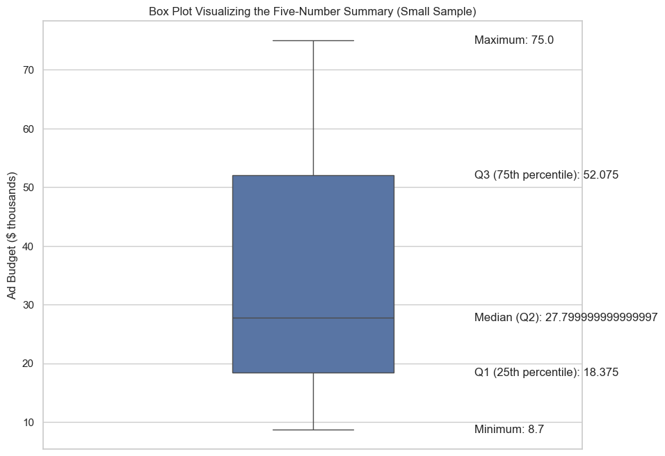
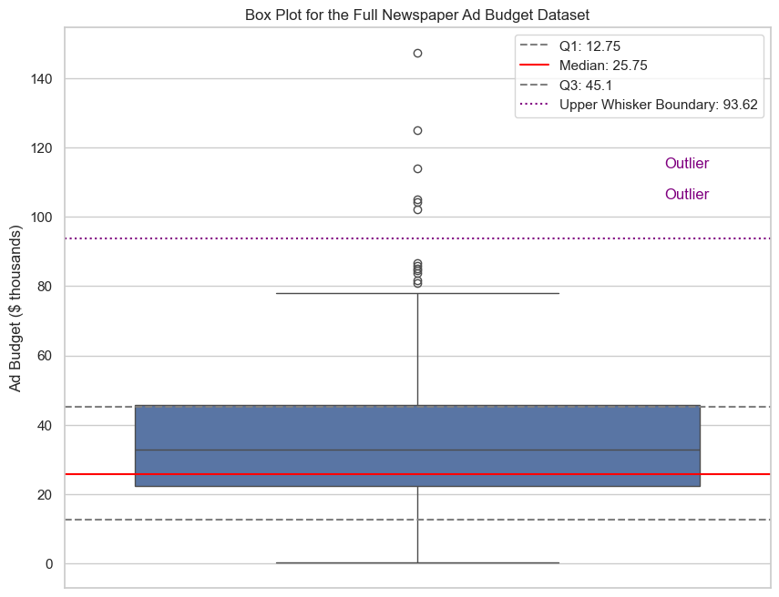

# Visualizing Data: Box Plots

A **box plot** (or a box-and-whiskers plot) is a standardized way of displaying the distribution of data based on its **five-number summary**: the minimum, first quartile (Q1), median (Q2), third quartile (Q3), and maximum.

It's an incredibly powerful tool for getting a quick overview of a variable's central tendency, spread, and skewness, and for spotting potential outliers.

Let's use our newspaper ad budget **subset** from the last lesson to build a box plot step-by-step.

**Five-Number Summary:**
* **Minimum:** 8.7
* **Q1 (25th percentile):** 18.35
* **Median (Q2):** 27.8
* **Q3 (75th percentile):** 52.95
* **Maximum:** 75.0

**1. The Box:**
* The central box is drawn from the first quartile (Q1) to the third quartile (Q3).
* The length of this box is the **Interquartile Range (IQR)**, which represents the middle 50% of the data.
    * `IQR = Q3 - Q1 = 52.95 - 18.35 = 34.6`
* A line is drawn inside the box at the **median**.

**2. The Whiskers:**
* The "whiskers" are the lines that extend from the box. They are drawn to the lowest and highest data points that are **within 1.5 times the IQR** from the box.
    * Lower bound: `Q1 - 1.5 * IQR`
    * Upper bound: `Q3 + 1.5 * IQR`
* In our small sample, the minimum (8.7) and maximum (75.0) are both within these bounds, so the whiskers extend to these values.

**3. Outliers:**
* Any data point that falls **outside** the whiskers is considered an **outlier** and is plotted as an individual point.

## Interpreting the Box Plot

A box plot gives us several insights at a glance:
* **Skewness:** We can see that the data is skewed. The distance from the median to Q3 is much larger than the distance from the median to Q1, indicating a **right-skewed** distribution.
* **Dispersion:** The length of the box (the IQR) and the whiskers show us the spread of the data.
* **Outliers:** In our small sample, there are no outliers.

## Another Plot with Outliers

Let's now look at a box plot for another dataset that includes some outliers.

---

**Next:** [Visualizing Data: Kernel Density Estimation](./14_kernel_density_estimation.md)