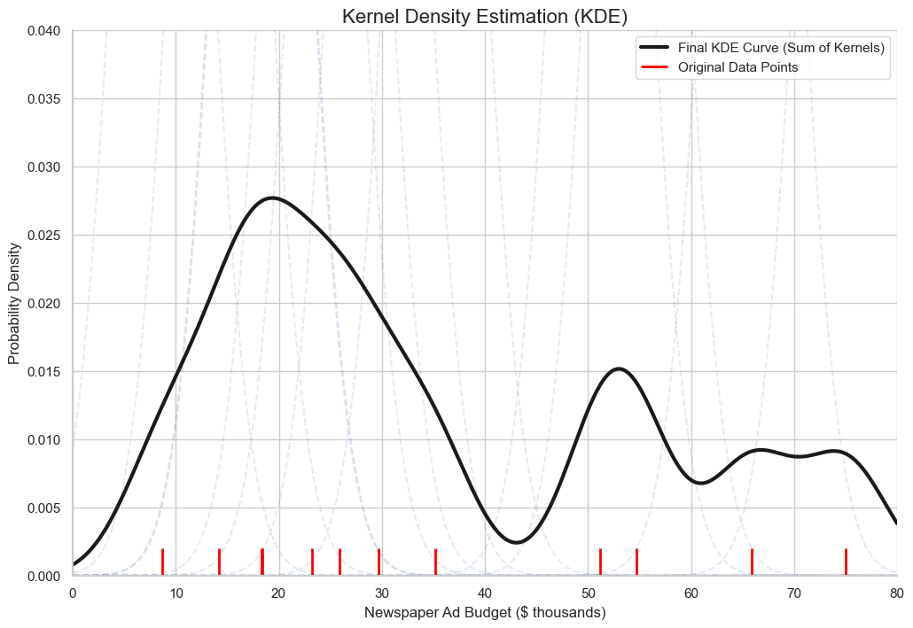
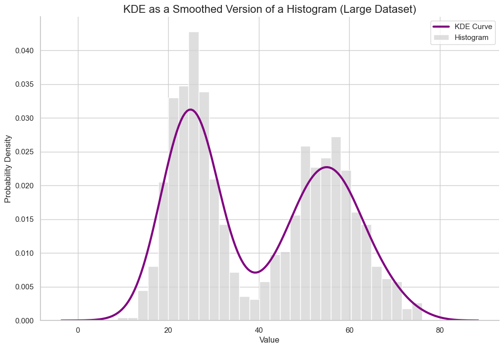

# Visualizing Data: Kernel Density Estimation

We've seen that for continuous variables, we can describe the probability distribution with a **Probability Density Function (PDF)**. But how do we get an idea of what the PDF looks like when we only have a sample of data?

A **histogram** is a good start. It satisfies the conditions of a density function (it's non-negative and its total area is 1). However, it's not a great approximation for a few reasons:
* It's not smooth and has sharp breaks at the bin edges.
* The shape of the histogram can change dramatically depending on how you choose the bin size.

A better method for approximating a smooth PDF from data is **Kernel Density Estimation (KDE)**.

## The Intuition Behind KDE

The core idea of KDE is to treat each data point as the center of its own "mini" distribution, and then sum all of these mini-distributions together to get a final, smooth curve.

1.  **Place a "kernel" on each data point.** A kernel is a small, smooth probability distribution, most commonly a small Gaussian (normal) curve. Each data point gets its own little "mountain."
2.  **Sum the kernels.** We add up the heights of all these individual kernels at every point along the x-axis.
3.  **Normalize.** We scale the resulting curve so that its total area is equal to 1.

Where there are many data points close together, their individual mountains will stack up, creating a high peak in the final curve. Where data points are sparse, the curve will be low.

_Note: The following plot doesn't look perfect, but that's because we are trying to estimate a smooth density from only 12 data points. As the number of data points increases, the KDE becomes a much better and more reliable approximation of the true underlying PDF of the data._

## A Better Example: KDE on a Larger Dataset

Let's see what happens when we have a much larger dataset. We will generate 1000 data points from a distribution and plot both a histogram and a KDE on the same axes.

Notice how the smooth KDE curve captures the overall shape of the blocky histogram, providing a much cleaner and more interpretable view of the data's distribution.

---

**Next:** [Visualizing Data: Violin Plots](./15_violin_plots.md)