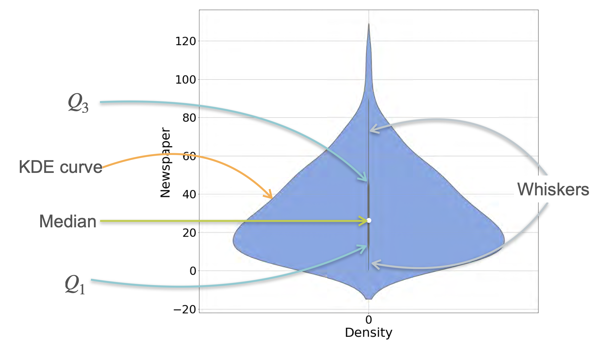

# Visualizing Data: Violin Plots

Finally, let's look at one last visualization tool that is widely used in data science: the **violin plot**.

What's so cool about violin plots? They cleverly combine the information from two other plots we've learned into a single, rich visualization:
1.  A **Box Plot**, showing the five-number summary (median, quartiles, and range).
2.  A **Kernel Density Estimation (KDE) Plot**, showing the smooth probability density of the data.

Essentially, a violin plot is a KDE curve mirrored on both sides of a box plot. This allows you to see the statistical summary and the full distribution shape at the same time.

