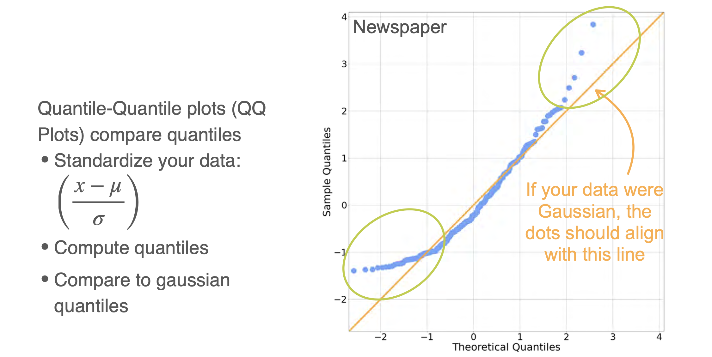
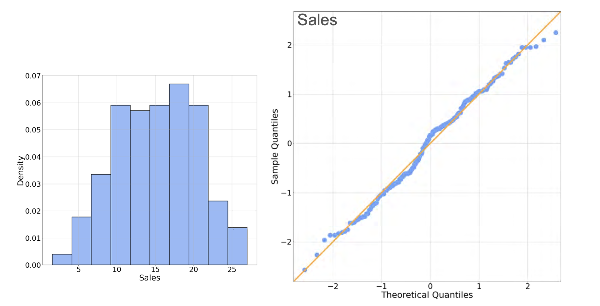

# Visualizing Data: QQ Plots

Checking for **normality** in data is a frequent and important task in data science. Many statistical tests and machine learning models (like Linear Regression) assume that the variables are normally distributed.

While a histogram can give us a rough idea, it can sometimes be misleading. A more precise graphical tool for inspecting if data is normally distributed is the **Quantile-Quantile (QQ) Plot**.

A QQ plot compares the quantiles of your actual data against the theoretical quantiles of a perfect normal distribution.

**The Core Idea:** If your data is truly normally distributed, then its quantiles should match the quantiles of a normal distribution. When plotted against each other, these points should form a straight diagonal line. Deviations from this straight line indicate that your data is not normal.

## Case 1: Non-Normal Data

Let's look at the QQ plot for the newspaper ad budget data, which we suspect is not normally distributed.

The QQ plot for the newspaper budget data confirms that it is **not normally distributed**.

* The data points form a curve, deviating significantly from the straight orange line (which represents where a perfectly normal distribution would lie).
* The points at the high end are much further from the line than the points at the low end, which is a classic sign of **right-skewness**.

## Case 2: Normally Distributed Data

Now let's look at the `sales` column from the same dataset, which appears more bell-shaped.

This time, the QQ plot confirms that the `sales` data is **approximately normally distributed**. The blue data points fall very closely along the straight orange reference line, indicating that the quantiles of our sample data match the theoretical quantiles of a normal distribution very well.

---

**Next:** [Joint Distribution (Discrete) - Part 1](../04_probability_distributions_with_multiple_variables/01_joint_distributions_for_discrete_variables--1.md)