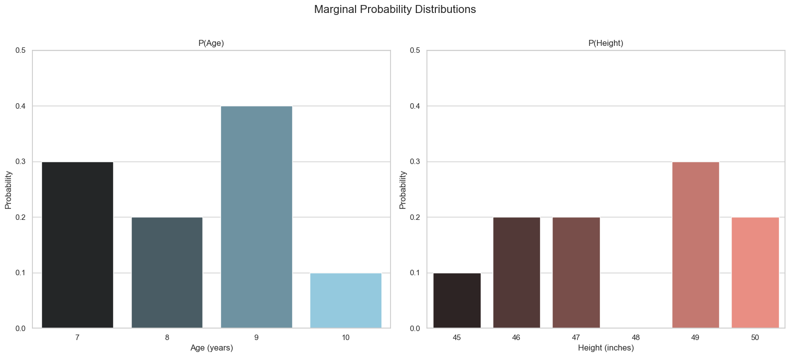

# Joint Distribution for Discrete Variables - Part 1

In the previous lessons, we learned about probability distributions for a single random variable. But what if we want to analyze two variables at the same time, for example, the **age** and **height** of a population, and see how they are related?

To do this, we need a **joint probability distribution**.

## The Dataset: Age and Height of 10 Children

Let's use the specific dataset from the video. We have 10 children with the following ages and heights:

| Age (X) | Height (Y, inches) |
| :---: | :---: |
| 7 | 45 |
| 7 | 46 |
| 7 | 46 |
| 8 | 47 |
| 8 | 47 |
| 9 | 49 |
| 9 | 49 |
| 9 | 49 |
| 9 | 50 |
| 10 | 50 |

First, let's look at the distribution of each variable separately. These are called **marginal distributions**.



## The Joint Probability

Looking at the distributions separately doesn't tell us how the variables are related. To answer a question like, "What is the probability that a child is 9 years old AND 49 inches tall?", we need the **joint probability**.

**Notation:**
The joint probability is written as $P(X=x, Y=y)$. This is the probability that the random variable `X` (Age) is equal to a specific value `x` (e.g., 9) AND the random variable `Y` (Height) is equal to a specific value `y` (e.g., 49).

To find this, we count the number of children who satisfy both conditions. From our data table, we can see there are **three** children who are 9 years old and 49 inches tall.
```math
P(\text{Age}=9, \text{Height}=49) = \frac{\text{Number of 9-year-olds who are 49 inches tall}}{\text{Total number of children}} = \frac{3}{10} = 0.3
```
<br>

## The Joint Distribution Table

The easiest way to represent a joint distribution is with a table (or matrix) that shows the probability for every possible combination of outcomes.

First, we create a table of **counts** based on our dataset:

| | **Height: 45"**|**Height: 46"**|**Height: 47"**|**Height: 48"**|**Height: 49"**|**Height: 50"**|
| :--- | :-: | :-: | :-: | :-: | :-: | :-: |
| **Age: 7** | 1 | 2 | 0 | 0 | 0 | 0 |
| **Age: 8** | 0 | 0 | 2 | 0 | 0 | 0 |
| **Age: 9** | 0 | 0 | 0 | 0 | 3 | 1 |
| **Age: 10** | 0 | 0 | 0 | 0 | 0 | 1 |

Now, we divide every count by the total number of children (10) to get the **Joint Probability Mass Function (PMF)**:

| | **Height: 45"**|**Height: 46"**|**Height: 47"**|**Height: 48"**|**Height: 49"**|**Height: 50"**|
| :--- | :-: | :-: | :-: | :-: | :-: | :-: |
| **Age: 7** | 0.1 | 0.2 | 0.0 | 0.0 | 0.0 | 0.0 |
| **Age: 8** | 0.0 | 0.0 | 0.2 | 0.0 | 0.0 | 0.0 |
| **Age: 9** | 0.0 | 0.0 | 0.0 | 0.0 | 0.3 | 0.1 |
| **Age: 10**| 0.0 | 0.0 | 0.0 | 0.0 | 0.0 | 0.1 |

With this table, we can easily look up any joint probability.
* $P(\text{Age}=8, \text{Height}=48) = 0.0$ (There are no children with this combination).
* $P(\text{Age}=7, \text{Height}=46) = 0.2$ (2 out of 10 children have this combination).

---

**Next** [Joint Distribution (Discrete) - Part 2](./02_joint_distributions_for_discrete_variables--2.md.md)