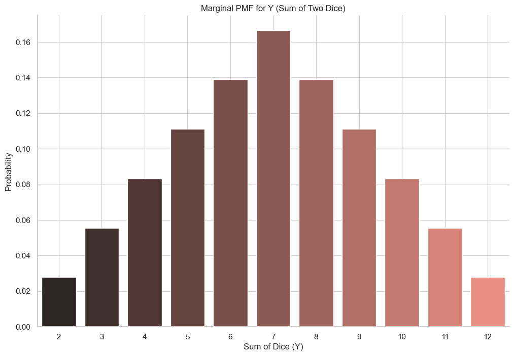

# Joint Distribution for Discrete Variables - Part 2

Let's continue our exploration of joint distributions with a classic example: rolling two fair six-sided dice.

## Case 1: Independent Variables
Let's define two random variables:
* **X:** The number rolled on the first die.
* **Y:** The number rolled on the second die.

The individual (marginal) PMF for both X and Y is the same: each outcome {1, 2, 3, 4, 5, 6} has a probability of 1/6.

Since the outcome of the first die does not affect the outcome of the second, `X` and `Y` are **independent random variables**.

For independent variables, the joint probability is simply the product of their individual probabilities:
```math
P(X=x, Y=y) = P(X=x) \cdot P(Y=y)
```
<br>

In this case, the probability of any specific outcome, like `(X=2, Y=5)`, is $\frac{1}{6} \times \frac{1}{6} = \frac{1}{36}$. This is true for all 36 possible combinations, resulting in a uniform joint distribution.

| | **Y=1** | **Y=2** | **Y=3** | **Y=4** | **Y=5** | **Y=6** |
| :--- | :---: | :---: | :---: | :---: | :---: | :---: |
| **X=1** | 1/36 | 1/36 | 1/36 | 1/36 | 1/36 | 1/36 |
| **X=2** | 1/36 | 1/36 | 1/36 | 1/36 | 1/36 | 1/36 |
| **X=3** | 1/36 | 1/36 | 1/36 | 1/36 | 1/36 | 1/36 |
| **X=4** | 1/36 | 1/36 | 1/36 | 1/36 | 1/36 | 1/36 |
| **X=5** | 1/36 | 1/36 | 1/36 | 1/36 | 1/36 | 1/36 |
| **X=6** | 1/36 | 1/36 | 1/36 | 1/36 | 1/36 | 1/36 |

## Case 2: Dependent Variables
Now let's look at a more complex example where the variables are **not** independent. We'll define two new random variables:
* **X:** The number rolled on the first die.
* **Y:** The **sum** of the numbers rolled on both dice.

The variable `Y` clearly depends on `X`. If `X=1`, then `Y` can only take values from 2 to 7. If `X=6`, `Y` can only take values from 7 to 12.

Let's look at the marginal PMF for `Y` (the sum of the dice).



## The Joint Distribution Table (Dependent Case)

Now, let's construct the joint PMF for `X` (first roll) and `Y` (sum). Each of the 36 possible outcomes, like `(X=1, Y=2)` which corresponds to the roll `(1, 1)`, has a probability of 1/36. All other combinations are impossible and have a probability of 0.

| **Y (Sum)** | **X=1** | **X=2** | **X=3** | **X=4** | **X=5** | **X=6** |
| :---: | :---: | :---: | :---: | :---: | :---: | :---: |
| **2** | 1/36 | 0 | 0 | 0 | 0 | 0 |
| **3** | 1/36 | 1/36 | 0 | 0 | 0 | 0 |
| **4** | 1/36 | 1/36 | 1/36 | 0 | 0 | 0 |
| **5** | 1/36 | 1/36 | 1/36 | 1/36 | 0 | 0 |
| **6** | 1/36 | 1/36 | 1/36 | 1/36 | 1/36 | 0 |
| **7** | 1/36 | 1/36 | 1/36 | 1/36 | 1/36 | 1/36 |
| **8** | 0 | 1/36 | 1/36 | 1/36 | 1/36 | 1/36 |
| **9** | 0 | 0 | 1/36 | 1/36 | 1/36 | 1/36 |
| **10** | 0 | 0 | 0 | 1/36 | 1/36 | 1/36 |
| **11** | 0 | 0 | 0 | 0 | 1/36 | 1/36 |
| **12** | 0 | 0 | 0 | 0 | 0 | 1/36 |

With this table, we can easily find any joint probability.
* **What is P(X=3, Y=7)?**
    * We look at the row for `Y=7` and the column for `X=3`. The probability is **1/36**. This corresponds to the single outcome where the first die is 3 and the second is 4.
* **What is P(X=1, Y=1)?**
    * We look at the row for `Y=1` and the column for `X=1`. The probability is **0**. This is an impossible event, as the minimum possible sum is 2.


---

**Next:** [Joint Distribution for Continuous Variables](./03_joint_distributions_for_continuous_variables.md)