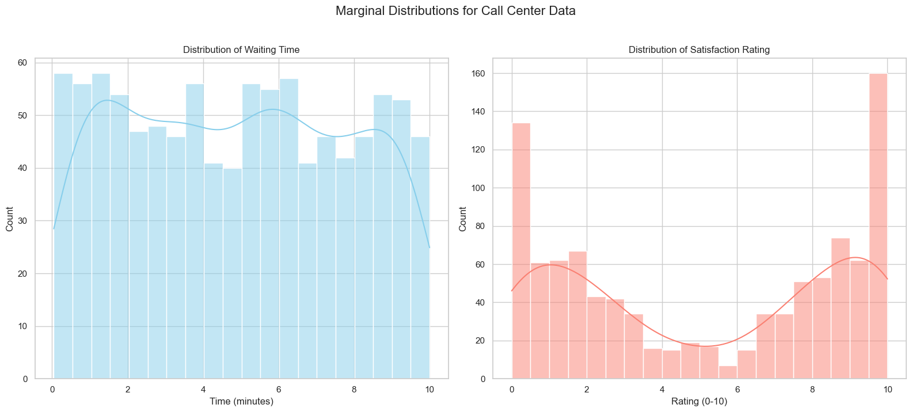
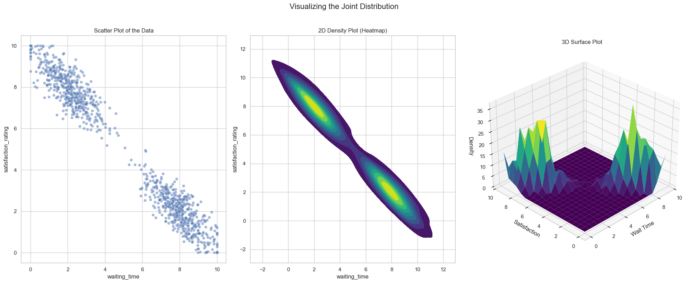

# Joint Distribution (Continuous)

So far, the joint distributions we've seen have involved discrete variables (like age and height rounded to the nearest inch). But what happens when both variables are **continuous**?

The core concepts are very similar, but instead of a joint Probability Mass Function (PMF) table, we will now have a joint **Probability Density Function (PDF)**, which is a 3D surface.

## The Motivating Example: Call Center Data
Let's consider a new dataset from a call center. We have two continuous random variables for 1,000 customers:
* **X:** The `waiting_time` before a call is picked up (a value between 0-10 minutes).
* **Y:** The `satisfaction_rating` given by the customer (a value between 0-10).

First, let's look at the individual (marginal) distributions for each variable.

## Visualizing the Joint Distribution

Now let's look at both variables at the same time. The joint distribution for two continuous variables can be visualized as a **3D surface**, where the height at any `(x, y)` point represents the probability density.

A common way to view this is with a 2D **heatmap** or **density plot**, which is like looking at the 3D mountain from directly above. Darker areas represent higher probability density (peaks), and lighter areas represent lower density (valleys).

For our call center data, we'd expect two peaks:
1.  **Low wait time, high satisfaction:** Customers who are helped quickly are happy.
2.  **High wait time, low satisfaction:** Customers who wait a long time are unhappy.

## Calculating the Mean and Variance

We can now calculate the mean and variance for each of our variables from the joint dataset.

**Mean (Expected Value):**
* $ E[X] = \mu_x = 4.903 $ minutes
* $ E[Y] = \mu_y = 5.280 $

**Variance:**
To calculate the variance, we use the formula $\text{Var}(X) = E[X^2] - (E[X])^2$.
* For X (Wait Time):
    * $ E[X^2] = 32.561 $
    * $ \text{Var}(X) = 32.561 - (4.903)^2 \approx 8.526 $
* For Y (Satisfaction):
    * $ E[Y^2] = 38.037 $
    * $ \text{Var}(Y) = 38.037 - (5.280)^2 \approx 10.163 $