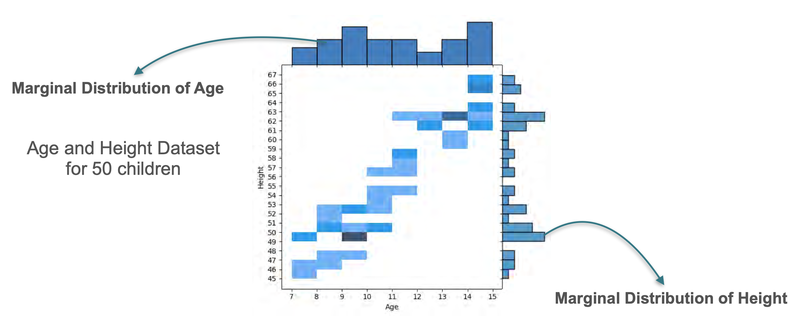
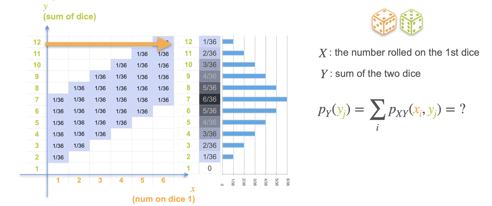
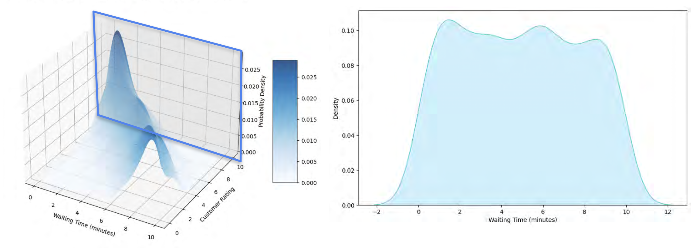

# Marginal Distributions

Now that we have a joint distribution, we can explore two very important concepts for extracting simpler insights from it: the **marginal distribution** and the **conditional distribution**.

* A **marginal distribution** is the probability distribution of a single variable, completely ignoring the outcome of the other. It's like looking at the "margins" or totals of our joint probability table.
* A **conditional distribution** is the probability distribution of one variable *given that* we know the value of the other. It's like taking a "slice" of our joint distribution.

Let's start with the marginal distribution.

## The Marginal Distribution (Discrete Case)

What if we have the full joint distribution of age and height, but we suddenly only care about the distribution of heights, regardless of age? To find this, we need to calculate the **marginal distribution of height**.

The process is simple: for each possible height, we sum up the probabilities across all possible ages. In our table, this is equivalent to **summing up each column**.

**Joint PMF Table:**
|             | **H=45** | **H=46** | **H=47** | **H=48** | **H=49** | **H=50** | **Marginal P(Age)** |
| :---------- | :------: | :------: | :------: | :------: | :------: | :------: | :-----------------: |
| **Age=7** | 0.1      | 0.2      | 0.0      | 0.0      | 0.0      | 0.0      | **0.3** |
| **Age=8** | 0.0      | 0.0      | 0.2      | 0.0      | 0.0      | 0.0      | **0.2** |
| **Age=9** | 0.0      | 0.0      | 0.0      | 0.0      | 0.3      | 0.1      | **0.4** |
| **Age=10** | 0.0      | 0.0      | 0.0      | 0.0      | 0.0      | 0.1      | **0.1** |
| **Marginal P(Height)** | **0.1** | **0.2** | **0.2** | **0.0** | **0.3** | **0.2** | **1.0** |

The bottom row, calculated by summing the columns, is the **marginal PMF for height**. Similarly, the rightmost column, calculated by summing the rows, is the **marginal PMF for age**.

Let's make our dataset larger with a total of 50 datapoints and add visualisation for the marginal distributions:

### Another Example: Sum of Two Dice

Let's return to the example where `X` is the roll of the first die and `Y` is the **sum** of the two dice. The joint distribution is shown in the table below.

To find the marginal distribution for `Y` (the sum), we simply **sum the probabilities across each row**.

| **Y (Sum)** | **X=1** | **X=2** | **X=3** | **X=4** | **X=5** | **X=6** | **Marginal P(Y)** |
| :---: | :---: | :---: | :---: | :---: | :---: | :---: | :---: |
| **2** | 1/36 | 0 | 0 | 0 | 0 | 0 | **1/36** |
| **3** | 1/36 | 1/36 | 0 | 0 | 0 | 0 | **2/36** |
| **4** | 1/36 | 1/36 | 1/36 | 0 | 0 | 0 | **3/36** |
| **5** | 1/36 | 1/36 | 1/36 | 1/36 | 0 | 0 | **4/36** |
| **6** | 1/36 | 1/36 | 1/36 | 1/36 | 1/36 | 0 | **5/36** |
| **7** | 1/36 | 1/36 | 1/36 | 1/36 | 1/36 | 1/36 | **6/36** |
| **8** | 0 | 1/36 | 1/36 | 1/36 | 1/36 | 1/36 | **5/36** |
| **9** | 0 | 0 | 1/36 | 1/36 | 1/36 | 1/36 | **4/36** |
| **10** | 0 | 0 | 0 | 1/36 | 1/36 | 1/36 | **3/36** |
| **11** | 0 | 0 | 0 | 0 | 1/36 | 1/36 | **2/36** |
| **12** | 0 | 0 | 0 | 0 | 0 | 1/36 | **1/36** |

This marginal distribution for the sum is the same triangular shape we saw in a previous lesson.

## The Marginal Distribution (Continuous Case)

The same concept applies to continuous joint distributions. If we have a 3D probability density surface for waiting time and customer rating, we can find the marginal distribution for waiting time by "squashing" or "aggregating" all the probability down onto the waiting time axis.

This process is equivalent to taking an integral, but visually, it's like projecting the entire 3D mountain onto one of the walls of the plot.

The result is a 1D probability distribution for a single variable, derived from the more complex 2D joint distribution.

---

**Next** [Conditional Distributions](./05_conditional_distributions.md)