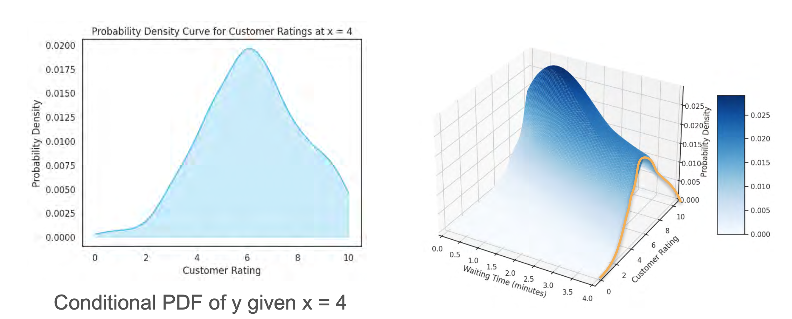

# Conditional Distribution

A **conditional distribution** is the distribution of one variable *given that* we know the value of another. It's like taking a "slice" of the joint distribution.

## Conditional Distribution (Discrete Case)

Let's return to our dataset of children's ages and heights.

**Joint PMF Table:**
|             | **H=45** | **H=46** | **H=47** | **H=48** | **H=49** | **H=50** | **Marginal P(Age)** |
| :---------- | :------: | :------: | :------: | :------: | :------: | :------: | :-----------------: |
| **Age=7** | 0.1      | 0.2      | 0.0      | 0.0      | 0.0      | 0.0      | **0.3** |
| **Age=8** | 0.0      | 0.0      | 0.2      | 0.0      | 0.0      | 0.0      | **0.2** |
| **Age=9** | 0.0      | 0.0      | 0.0      | 0.0      | 0.3      | 0.1      | **0.4** |
| **Age=10** | 0.0      | 0.0      | 0.0      | 0.0      | 0.0      | 0.1      | **0.1** |

What if we want to know the distribution of heights for **only the children who are 9 years old**?

We take a "slice" of our table by looking only at the row where `Age=9`:
`[0.0, 0.0, 0.0, 0.0, 0.3, 0.1]`

There's a small problem: the sum of these probabilities is `0.3 + 0.1 = 0.4`, not 1. This is not a valid probability distribution.

To fix this, we need to **normalize** the slice by dividing each probability in the row by the sum of that row (which is the marginal probability, `P(Age=9)`).

* P(Height=49 | Age=9) = 0.3 / 0.4 = 0.75
* P(Height=50 | Age=9) = 0.1 / 0.4 = 0.25

Now the probabilities sum to 1. This new distribution is the **conditional distribution** of height, given that age is 9.

### The Formal Rule
This process is an application of the conditional probability formula we've already learned. The conditional PMF of `Y` given `X=x` is:
```math
P(Y=y | X=x) = \frac{P(X=x, Y=y)}{P(X=x)}
```
*(Where the numerator is the joint probability and the denominator is the marginal probability).*
<br>

## Conditional Distribution (Continuous Case)

The concept is exactly the same for continuous variables. To find the conditional distribution of `Y` given a specific value of `X` (e.g., `X=4`), we take a "slice" of the 3D joint PDF at that `x` value.



The resulting 2D curve on that slice gives us the *shape* of the conditional distribution. Just like in the discrete case, we then have to **normalize** this curve so that its total area is 1, making it a valid PDF.

```math
f_{Y|X}(y|x) = \frac{f_{X,Y}(x,y)}{f_X(x)}
```
*(Where the numerator is the joint PDF and the denominator is the marginal PDF.)*