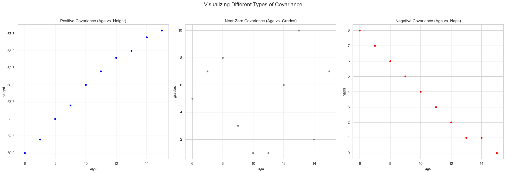

# Covariance of a Dataset

So far, we've focused on describing a single random variable using its mean and variance. But what if we want to understand the **relationship between two variables**? For example, we can assume that as a child's age increases, their height also tends to increase.

The **covariance** is a measure that quantifies this relationship. It tells us the direction of the linear relationship between two variables.

To explore this, let's use the dataset from the video, which considers three scenarios for a group of children:
1.  **Age vs. Height:** We expect a positive relationship.
2.  **Age vs. Grades:** We might expect no clear relationship.
3.  **Age vs. Naps per day:** We expect a negative relationship.

## The Intuition Behind Covariance

How can we capture these different trends with a single formula? The key is to look at the data relative to its center point (the mean of X and the mean of Y).

If we center the data so the mean is at the origin (0,0), we can divide the plot into four quadrants.

* **Positive Covariance:** Most data points will fall in the top-right (where `x` and `y` are both positive) and bottom-left (where `x` and `y` are both negative) quadrants. In both cases, the product of the coordinates, `x * y`, will be **positive**.
* **Negative Covariance:** Most data points will fall in the top-left (`x` negative, `y` positive) and bottom-right (`x` positive, `y` negative) quadrants. In both cases, the product `x * y` will be **negative**.
* **Zero Covariance:** The points will be spread evenly across all four quadrants, and the positive and negative products will cancel each other out.

The **covariance** is essentially the average of these products for the centered data.



## The Formula and Calculated Results

The formal definition of the covariance between two variables `X` and `Y` is the expected value of the product of their deviations from their respective means. For a sample of data, this is calculated as:

```math
\text{Cov}(X, Y) = \frac{1}{n-1}\sum_{i=1}^{n} (x_i - \mu_x)(y_i - \mu_y)
```
<br>

Let's calculate the covariance for each of our three scenarios.

| Scenario | Mean of X (Age) | Mean of Y | **Calculated Covariance** | Relationship |
| :--- | :---: | :---: | :---: | :--- |
| **Age vs. Height** | 10.5 | 60.0 | **17.0** | **Positive** |
| **Age vs. Grades** | 10.5 | 5.0 | **0.1** | **Near-Zero** |
| **Age vs. Naps** | 10.5 | 3.7 | **-7.45** | **Negative** |

The calculated values perfectly match our visual intuition from the scatter plots.