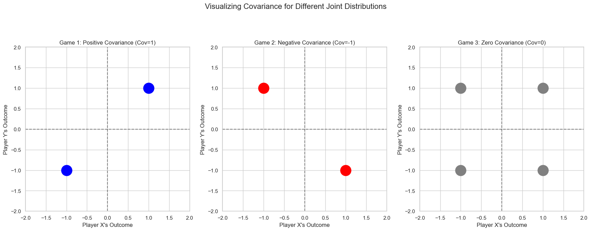
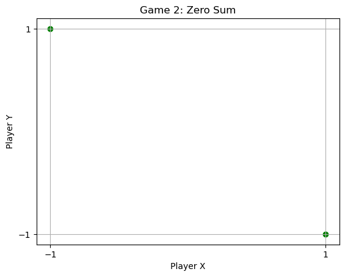
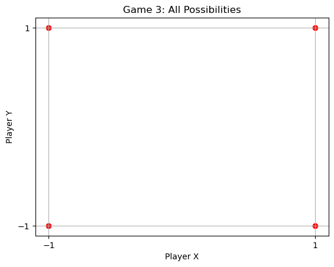
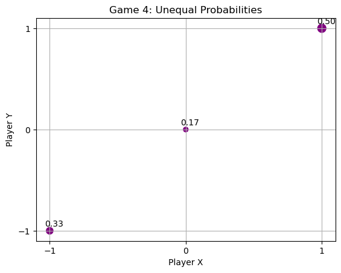

# Covariance of a Probability Distribution

## Scenario Overview

Players X and Y play three games, each with outcomes that affect their winnings (either $+1$ or $-1$). For each game, the joint outcomes and their probabilities differ, leading to different covariance values. Covariance helps distinguish the relationships between player outcomes that expectancy and variance alone cannot.

## Game Definitions & Outcome Diagrams

### Game 1

- **Outcomes**: Both players win $1$ $(+1, +1)$, or both lose $1$ $(-1, -1)$
- **Probability**: Each outcome has probability $\frac{1}{2}$

**Graph**: Points at $(1, 1)$ and $(-1, -1)$, each with $0.5$ probability.

### Game 2

- **Outcomes**: X wins $1$, Y loses $1$ $(+1, -1)$; X loses $1$, Y wins $1$ $(-1, +1)$
- **Probability**: Each outcome has probability $\frac{1}{2}$

**Graph**: Points at $(1, -1)$ and $(-1, 1)$, each with $0.5$ probability.

### Game 3

- **Outcomes**: Both win $1$ $(+1, +1)$, both lose $1$ $(-1, -1)$, X wins/Y loses $(+1, -1)$, X loses/Y wins $(-1, +1)$
- **Probability**: Each outcome has probability $\frac{1}{4}$

**Graph**: Points at $(1, 1)$, $(1, -1)$, $(-1, 1)$, $(-1, -1)$, each with $0.25$ probability.

### Game 4

- **Outcomes**: Both win $1$ $(+1, +1)$, both lose $1$ $(-1, -1)$, or neither wins/loses $(0, 0)$
- **Probabilities**: Win: $\frac{1}{2}$, Lose: $\frac{1}{3}$, Nothing: $\frac{1}{6}$

**Graph**: Points at $(1, 1)$ [0.5], $(-1, -1)$ [0.33], $(0, 0)$ [0.17]

## Expectation and Variance Calculations

For all games except Game 4:
- $ E[X] = E[Y] = 0 $  
  (average winnings are zero)
- $ \operatorname{Var}(X) = \operatorname{Var}(Y) = 1 $  
  (variance of individual outcomes is $1$)

**Game 4:**
- $ E[X] = E[Y] = \frac{1}{6} $
- $ \operatorname{Var}(X) = \operatorname{Var}(Y) = 0.806 $  
  (calculated using weighted probabilities)

## Covariance Calculations

- **Covariance** measures how two variables change together.
- Formula for discrete distributions (possibly unequal probabilities):

$ \operatorname{Cov}(X, Y) = E\left[(X - E[X])(Y - E[Y])\right] = \sum_{i} p_i \cdot (X_i - E[X]) (Y_i - E[Y]) $

Or equivalently:

$ \operatorname{Cov}(X,Y) = E[XY] - E[X]E[Y] $

### Game 1

- Both win or both lose together.
- $ \operatorname{Cov}(X, Y) = 1 $
- Positive correlation: outcomes move together.

### Game 2

- One wins, other loses.
- $ \operatorname{Cov}(X, Y) = -1 $
- Negative correlation: outcomes move oppositely.

### Game 3

- All combinations equally likely.
- $ \operatorname{Cov}(X, Y) = 0 $
- No correlation: knowing one outcome doesn’t predict the other.

### Game 4

- Unequal probabilities.
- $ \operatorname{Cov}(X, Y) = 0.806 $
- Calculate using the general formula and weighted probabilities.

---

## Covariance Distinguishes Games

- **Expectation and variance** of individual players do not distinguish these games.
- **Covariance** reveals the relationship:
  - Positive covariance: players win/lose together.
  - Negative covariance: player's outcomes are opposed.
  - Zero covariance: outcomes are independent.

---

## Practical Example: Waiting Time vs Customer Rating

- **X**: Waiting time for a phone call.
- **Y**: Customer rating.
- **Observation**: As waiting time increases, rating decreases (negative correlation).

**Covariance Calculation**:

$ E[XY] = 18.014 $  
$ E[X] = 5.297 $  
$ E[Y] = 4.917 $  
$ \operatorname{Cov}(X, Y) = E[XY] - E[X]E[Y] = 18.014 - (5.297 \times 4.917) = -7.878 $

**Graph**: {add screenshot of graph for waiting time vs rating here}

---

## Summary Table

| Game   | Main Outcomes                               | Probabilities         | Covariance | Notes          |
|--------|---------------------------------------------|----------------------|------------|----------------|
| Game 1 | Both win or both lose                       | $ \frac{1}{2} $ each      | $+1$       | Positive corr. |
| Game 2 | One wins, other loses                       | $ \frac{1}{2} $ each      | $-1$       | Negative corr. |
| Game 3 | All combinations (win/lose)                 | $ \frac{1}{4} $ each      | $0$        | No corr.       |
| Game 4 | Both win, both lose, or nothing             | $ \frac{1}{2}, \frac{1}{3}, \frac{1}{6} $ | $+0.806$    | Weighted corr. |

---

## Key Takeaways

- Covariance quantifies the relationship between two random variables.
- It is essential for distinguishing joint distributions, especially when expectation and variance are identical.
- Positive covariance means variables increase together, negative means they move oppositely, zero means independence.