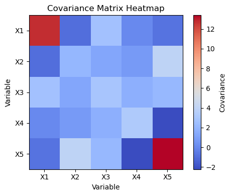

# Covariance Matrix

So far, we've explored variance and covariance for joint distributions using examples like age vs. height, grades vs. naps, and several game scenarios. We saw that expectation and variance alone cannot distinguish relationships between variables, but covariance can. Now, let's extend these ideas to datasets with more than two variables.

## What Is a Covariance Matrix?

When you have a dataset with $n$ variables, you can compute:
- The variance of each variable (how much each variable spreads out)
- The covariance between each pair of variables (how two variables change together)

All these values can be organized into a single matrix called the **covariance matrix**.  
- The diagonal entries are the variances of each variable.
- The off-diagonal entries are the covariances between pairs of variables.

For $n$ variables, the covariance matrix is an $n \times n$ matrix, often denoted by $\Sigma$ (sigma).

## Covariance Matrix Structure

For variables $X_1, X_2, \ldots, X_n$, the covariance matrix looks like:

$$
\Sigma =
\begin{pmatrix}
\mathrm{Var}(X_1) & \mathrm{Cov}(X_1, X_2) & \cdots & \mathrm{Cov}(X_1, X_n) \\
\mathrm{Cov}(X_2, X_1) & \mathrm{Var}(X_2) & \cdots & \mathrm{Cov}(X_2, X_n) \\
\vdots & \vdots & \ddots & \vdots \\
\mathrm{Cov}(X_n, X_1) & \mathrm{Cov}(X_n, X_2) & \cdots & \mathrm{Var}(X_n)
\end{pmatrix}
$$

- Diagonal: variances
- Off-diagonal: covariances

## Example: Age vs. Height

Suppose we have two variables: age and height. The covariance matrix is:

$$
\Sigma =
\begin{pmatrix}
\mathrm{Var}(\text{age}) & \mathrm{Cov}(\text{age}, \text{height}) \\
\mathrm{Cov}(\text{height}, \text{age}) & \mathrm{Var}(\text{height})
\end{pmatrix}
$$

## Example: Game Scenarios

For the games with two players (X and Y), the covariance matrices for Game 1 and Game 2 are:

**Game 1:**
```math
\Sigma =
\begin{pmatrix}
1 & 1 \\
1 & 1
\end{pmatrix}
```
<br>

**Game 2:**
```math
\Sigma =
\begin{pmatrix}
1 & -1 \\
-1 & 1
\end{pmatrix}
```
<br>

## Three Variables Example

If you have three variables, the covariance matrix is $3 \times 3$:

$$
\Sigma =
\begin{pmatrix}
\mathrm{Var}(X) & \mathrm{Cov}(X, Y) & \mathrm{Cov}(X, Z) \\
\mathrm{Cov}(Y, X) & \mathrm{Var}(Y) & \mathrm{Cov}(Y, Z) \\
\mathrm{Cov}(Z, X) & \mathrm{Cov}(Z, Y) & \mathrm{Var}(Z)
\end{pmatrix}
$$

## Visualization

To visualize a covariance matrix, you can use a heatmap. 



## Why Is the Covariance Matrix Important?

- It summarizes all pairwise relationships in your dataset.
- Used in principal component analysis (PCA), multivariate normal distributions, and many machine learning algorithms.
- Helps understand which variables move together and which are independent.

## Key Takeaways

- The covariance matrix generalizes variance and covariance to multiple variables.
- Diagonal entries are variances; off-diagonal entries are covariances.
- It is a foundational tool in statistics

---

**Next:** [Correlation Coefficient](./09_correlation_coefficient.md)