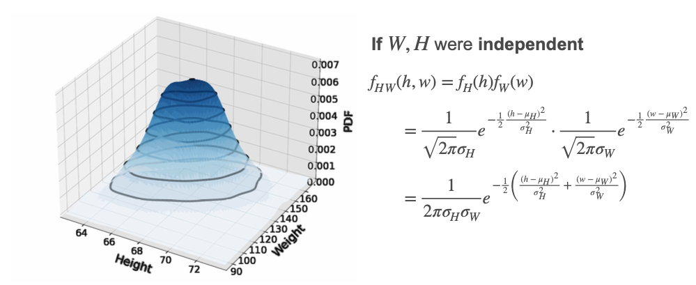
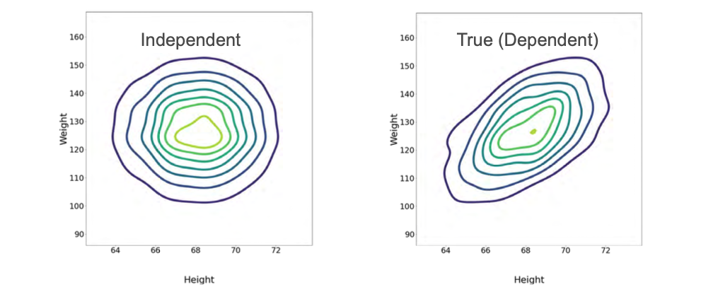
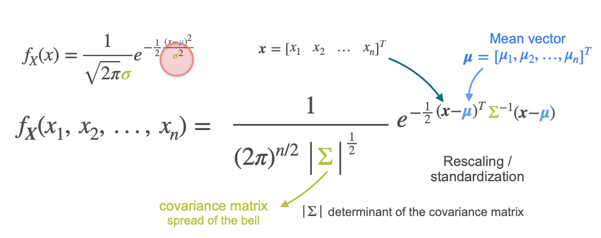

# Multivariate Gaussian Distribution

Previously, you learned about the normal (Gaussian) distribution for a single variable. The familiar bell curve is defined by two parameters:
- $\mu$: the mean (center of the bell)
- $\sigma$: the standard deviation (spread of the bell)

But what if you have more than one variable? For example, consider height ($h$) and weight ($w$) of adults. If you collect a dataset with both variables, you can look at their marginal distributions—each is Gaussian with its own mean and standard deviation.

## Joint Distribution: Independence vs. Dependence

If the two variables are independent, the joint probability density function (PDF) is simply the product of the marginal PDFs. This results in a symmetric bell-shaped surface in two dimensions.

However, in real data, variables like height and weight are often correlated. The joint distribution is then elongated along a line with positive slope, reflecting the positive correlation. The level curves (contours) of the distribution become ellipses rather than circles.

## The Role of Covariance

The deformation of the joint distribution is caused by the covariance between the variables. For height and weight, people tend to weigh more when they are taller, resulting in positive covariance.

## Algebraic Formulation

For independent variables, the exponent in the joint PDF is the sum of the exponents for each variable. This can be written as the squared norm of a vector, or as a dot product involving a diagonal matrix of variances.

For dependent variables, the covariance matrix replaces the diagonal matrix. The covariance matrix captures both the variances (spread of each variable) and covariances (how variables move together).

## Multivariate Gaussian Formula

The general formula for the multivariate Gaussian PDF for $n$ variables is:

$$
f(\mathbf{x}) = \frac{1}{(2\pi)^{n/2} |\Sigma|^{1/2}} \exp\left( -\frac{1}{2} (\mathbf{x} - \boldsymbol{\mu})^T \Sigma^{-1} (\mathbf{x} - \boldsymbol{\mu}) \right)
$$

Where:
- $\mathbf{x}$ is the vector of variables
- $\boldsymbol{\mu}$ is the vector of means
- $\Sigma$ is the covariance matrix
- $|\Sigma|$ is the determinant of the covariance matrix
- $\Sigma^{-1}$ is the inverse of the covariance matrix

- The diagonal elements of $\Sigma$ are the variances of each variable.
- The off-diagonal elements are the covariances between variables.

## Key Points

- The multivariate Gaussian generalizes the normal distribution to multiple variables.
- The covariance matrix determines the shape and orientation of the distribution.
- The determinant of the covariance matrix controls the "volume" or spread.
- The mean vector sets the center of the distribution.

## Applications

- Multivariate Gaussian distributions are widely used in statistics and machine learning.
- They model joint behavior of multiple variables, such as in principal component analysis (PCA), Gaussian mixture models, and more.

---

**Next:** [Population and Sample](../05_population_and_sample/01_population_and_sample.md)