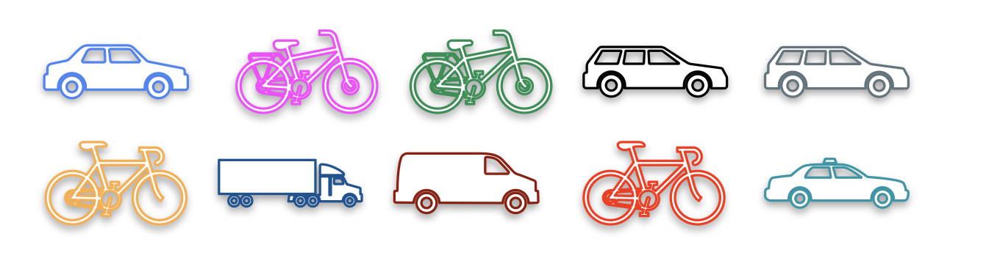

# Sample Proportion

Once again, for illustration's sake, imagine that there's only ten people living in Statistopia. That means you have a population size of 10. Everyone has some form of transportation—either a car or a bicycle.



## Population Proportion

To find the proportion of people who own a bicycle:
- Identify everyone with a bicycle.
- Divide by the total number of people.

Example:  
If 4 out of 10 people own a bicycle, the population proportion is $4/10 = 0.4$ or 40%.

This metric is called the **population proportion**, denoted by $P$:

```math
P = \frac{\text{Number with characteristic } x}{N}
```
<br>

where $N$ is the population size.

## Sample Proportion

If you don't have access to the full population, you use a random sample.

Example:  
Take a random sample of 6 people.  
If 2 out of 6 own a bicycle, the sample proportion is $2/6 \approx 0.333$ or 33.3%.

This metric is the **sample proportion**, denoted by $\hat{P}$:

```math
\hat{P} = \frac{\text{Number with characteristic in sample}}{n}
```
<br>

where $n$ is the sample size.

**Key Point:**  
The sample proportion $\hat{P}$ is an estimate of the population proportion $P$.

---

**Next:** []()