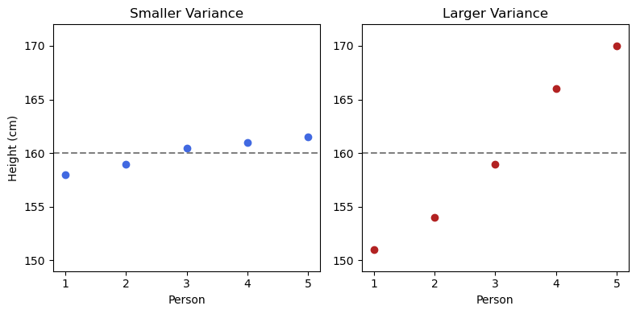

# Sample Variance

Variance measures how spread out your data is—it tells you how far points are from their mean. Let's look at two example datasets of heights (in cm) for five people:

- **smaller_var:** [158, 159, 160.5, 161, 161.5]  
  (points are close to the mean)
- **larger_var:** [151, 154, 159, 166, 170]  
  (points are farther from the mean)

Both datasets have a mean of 160, but their variances are different.

## Visual Comparison

```python
# Save as images/0401.png
import matplotlib.pyplot as plt

smaller_var = [158, 159, 160.5, 161, 161.5]
larger_var = [151, 154, 159, 166, 170]

plt.figure(figsize=(8, 4))
plt.subplot(1, 2, 1)
plt.scatter(range(1, 6), smaller_var, color='royalblue')
plt.axhline(160, color='gray', linestyle='--')
plt.title('Smaller Variance')
plt.xlabel('Person')
plt.ylabel('Height (cm)')

plt.subplot(1, 2, 2)
plt.scatter(range(1, 6), larger_var, color='firebrick')
plt.axhline(160, color='gray', linestyle='--')
plt.title('Larger Variance')
plt.xlabel('Person')

plt.tight_layout()
plt.savefig('images/0401.png')
plt.show()
```



## Population Variance

The formula for population variance ($\sigma^2$) is:
$$
\sigma^2 = \frac{1}{N} \sum_{i=1}^N (x_i - \mu)^2
$$
where $\mu$ is the population mean and $N$ is the population size.

For both datasets, $\mu = 160$.

- **smaller_var:**  
  $\sigma^2 = \frac{(158-160)^2 + (159-160)^2 + (160.5-160)^2 + (161-160)^2 + (161.5-160)^2}{5} = \frac{4 + 1 + 0.25 + 1 + 2.25}{5} = \frac{8.5}{5} = 1.7$
- **larger_var:**  
  $\sigma^2 = \frac{(151-160)^2 + (154-160)^2 + (159-160)^2 + (166-160)^2 + (170-160)^2}{5} = \frac{81 + 36 + 1 + 36 + 100}{5} = \frac{254}{5} = 50.8$

## Estimating Variance from a Sample

In practice, you rarely have access to the whole population. Instead, you estimate variance from a sample.

### Naive Sample Variance

If you use the sample mean and divide by the sample size $n$, you get:
$$
\hat{\sigma}^2 = \frac{1}{n} \sum_{i=1}^n (x_i - \bar{x})^2
$$
where $\bar{x}$ is the sample mean.

However, this estimator is **biased**—it tends to underestimate the true population variance.

### Unbiased Sample Variance

To correct for this bias, divide by $n-1$ instead of $n$:
$$
s^2 = \frac{1}{n-1} \sum_{i=1}^n (x_i - \bar{x})^2
$$

This is called the **unbiased sample variance** and is the most common estimator in statistics.

## Why Divide by $n-1$?

Using $n-1$ in the denominator corrects for the bias introduced by using the sample mean instead of the population mean.  
- For small samples, the difference between dividing by $n$ and $n-1$ is significant.
- For large samples, the difference is negligible.

## Example Calculation

Suppose you randomly select 3 values from `larger_var`: [151, 159, 170].

- Sample mean: $\bar{x} = \frac{151 + 159 + 170}{3} = 160$
- Naive variance: $\frac{(151-160)^2 + (159-160)^2 + (170-160)^2}{3} = \frac{81 + 1 + 100}{3} = 60.67$
- Unbiased variance: $\frac{(151-160)^2 + (159-160)^2 + (170-160)^2}{2} = \frac{182}{2} = 91$

## Summary

- Use the population variance formula if you have all data.
- Use the unbiased sample variance ($s^2$) if you only have a sample.
- Dividing by $n-1$ gives a better estimate of the true population variance.

---

**Next:** []()