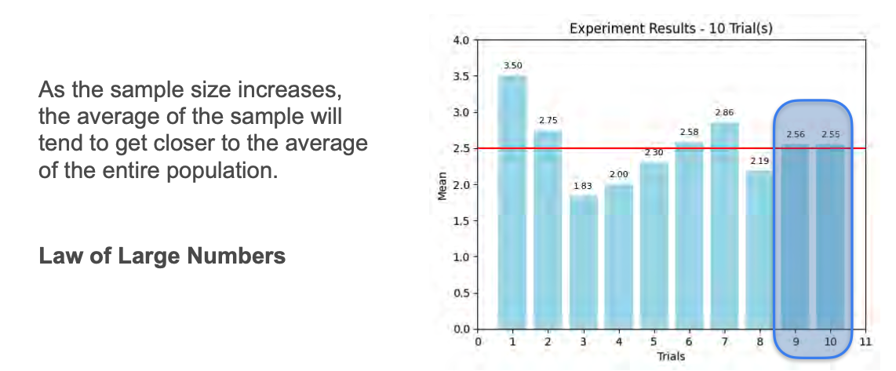

# Law of Large Numbers

Suppose you want to estimate the average height of all humans. Measuring one person gives a noisy estimate. Measuring two or three and averaging their heights gives a slightly better estimate. Using 10, 100, or 1,000 people improves the estimate even more.

This principle applies to other metrics, not just the mean. This is the **law of large numbers**.

## Dice Example

Consider a fair 4-sided die with outcomes 1, 2, 3, 4. The population mean is 2.5.

If you throw the die twice and record the average, you get all possible pairs and their averages. The mean of all these outcomes is still 2.5.

Now, draw samples one at a time:
- First sample: (4, 3) → average is 3.5
- Next samples: (3, 4), (1, 3), etc.

As you increase the number of samples and average their outcomes, the sample mean gets closer to the population mean.



## Formal Statement

If $n$ is the number of samples and each $X_i$ is a random variable sampled from the population (i.i.d.), then as $n$ increases, the sample mean approaches the population mean ($\mu$):

```math
\lim_{n \to \infty} \frac{1}{n} \sum_{i=1}^n X_i = \mu
```
<br>

## Conditions

- Samples must be drawn randomly from the population.
- Sample size must be sufficiently large.
- Observations must be independent.

## Key Takeaway

The law of large numbers guarantees that as your sample size grows, your sample mean will get closer to the true population mean.

---

**Next:** []()