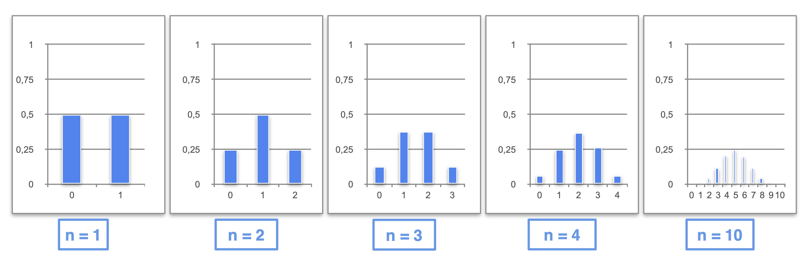
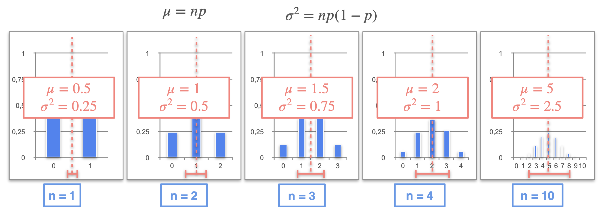

# Central Limit Theorem for Discrete Random Variables

Remember, the normal distribution appears in many places—even where you might not expect it. Take any distribution, even a skewed one. If you repeatedly take samples of the same size, calculate their averages, and plot those averages, you’ll see a normal distribution emerge, no matter the original distribution.

This remarkable result is called the **Central Limit Theorem (CLT)**.

## Coin Flip Example

Let’s start with a familiar discrete random variable: flipping a fair coin.

- For one flip, $X = 1$ for heads, $X = 0$ for tails.
- Probability distribution: $P(X=1) = 0.5$, $P(X=0) = 0.5$

Now, increase the number of coin flips:

- For two coins, three coins, four coins, and so on, the distribution of the number of heads starts to look more and more like a bell curve (normal distribution).

Counting the number of heads in $n$ coin flips is the same as adding $n$ Bernoulli random variables (each is 1 for heads, 0 for tails).

## The Central Limit Theorem

The CLT says:  

> As you increase the number of variables you add (or average), the distribution of their sum (or average) approaches a normal distribution, regardless of the original variable’s distribution.

## Mean and Variance for Coin Flips

For $n$ coin flips with probability $p$ of heads:

- Mean: $\mu = n p$
- Variance: $\sigma^2 = n p (1-p)$

Examples:
- $n = 1$: mean = $0.5$, variance = $0.25$
- $n = 2$: mean = $1$, variance = $0.5$
- $n = 3$: mean = $1.5$, variance = $0.75$
- $n = 4$: mean = $2$, variance = $1$
- $n = 10$: mean = $5$, variance = $2.5$

As $n$ becomes large, the distribution of the sum (number of heads) becomes approximately normal, with mean $n p$ and variance $n p (1-p)$.

## Key Takeaway

No matter the starting distribution, the averages of large samples will be normally distributed. This is the power of the Central Limit Theorem.

---

**Next:** [Central Limit Theorem for Continuous Random Variables](./07_central_limit_theorem--continuous_random_variable.md)